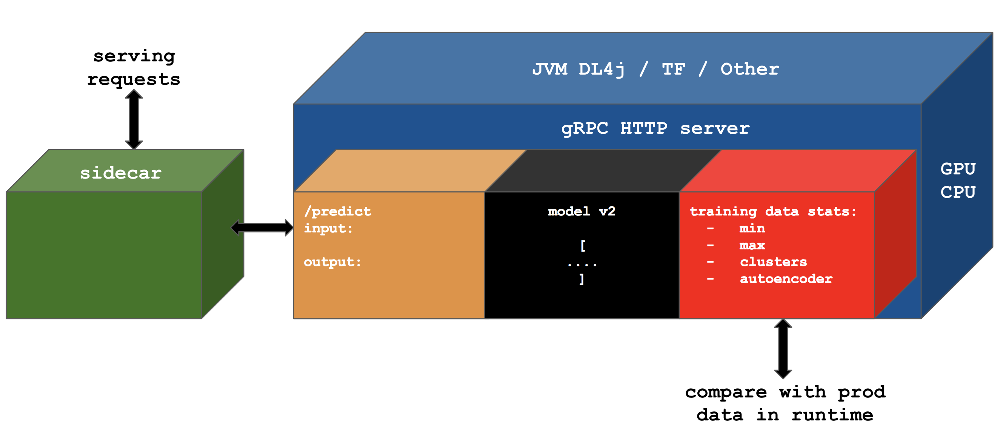

# Hydro-serving

[](https://gitter.im/Hydrospheredata/hydro-serving?utm_source=badge&utm_medium=badge&utm_campaign=pr-badge&utm_content=badge)

Hydro Serving is a Machine Learning Serving cluster. 

Features:
* **Serverless** user experience in your data center or public cloud. 
* State of the art architecture based on **Service mesh** powered by Envoy proxy  
* **Plumbing**. Automatic generation of Protobuf contracts for REST, gRPC and Streaming Kafka API from the model metadata
* Safe experiments and models warm up on **shadowed or canary traffic**
* Unified across ML frameworks
* Automatic data profiling and statistical check of the model quality 
* Immutable model versioning
* Agnostic to training pipeline and notebook environment 
* **Multi-framework Pipelines** (e.g. Scikit-learn -> Spark ML -> TensorFlow pipeline)
* Out of the box tuned and optimized Serving Runtimes
* Models optimization for Serving

## Quick Start

#### Run
```
#Clone repository
git clone https://github.com/Hydrospheredata/hydro-serving

cd ./hydro-serving
docker-compose up
```

Go to UI: http://localhost/

#### Deploy your first model

```bash
#Install Serving CLI
pip install hs

# Clone repo with example models
git clone https://github.com/Hydrospheredata/hydro-serving-examples
cd hydro-serving-examples/stateful_lstm_example/pipeline/lstm
# Upload model to the server
hs upload
```

#### Check UI - explore, deploy and test models


## Model Server Architecture



## Related repositories
 * Runtimes:
   * Tensorflow: https://github.com/Hydrospheredata/hydro-serving-tensorflow
   * Python: https://github.com/Hydrospheredata/hydro-serving-python
   * Spark: https://github.com/Hydrospheredata/hydro-serving-spark
     * Spark local inference implementation: https://github.com/Hydrospheredata/spark-ml-serving
 * Protobuf messages: https://github.com/Hydrospheredata/hydro-serving-protos
 * Sidecar implementation: https://github.com/Hydrospheredata/hydro-serving-sidecar
 * Example models: https://github.com/Hydrospheredata/hydro-serving-example/tree/master/models
