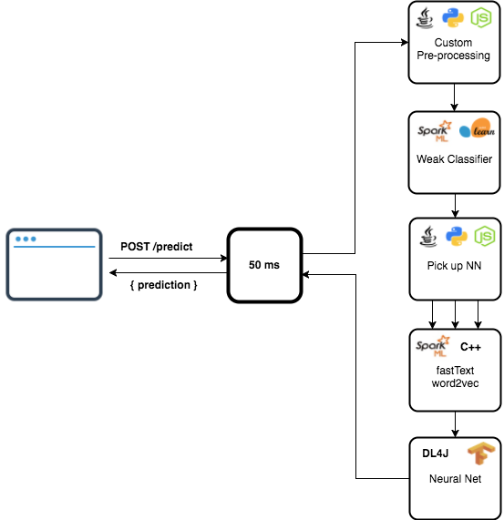
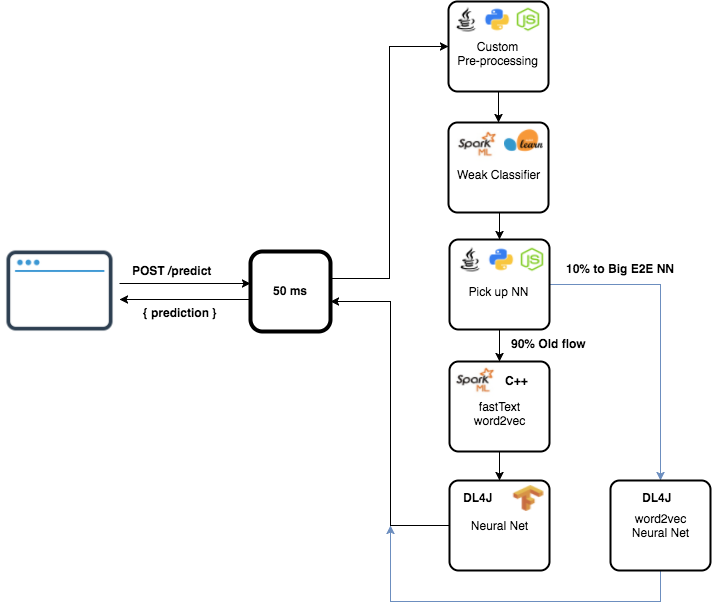

# Hydro-serving

Hydro Serving is a Machine Learning Serving cluster. 

Main Features:
* **Serverless**. It is as easy as AWS Lambda in your data center or VPC. 
* **Multi-framework Pipelines** (e.g. Scikit-learn -> Spark ML -> TensorFlow pipeline)

##### Story
Deploying skit-learn models for serving online user requests is pretty simple: just spin up an HTTP server, load the model and call `predict()` method. Performance wise it will satisfy most of the use cases.
TensorFlow serving is a bit more complicated to manage but feasible as well.
For Spark ML you would need to use [spark-ml-serving](https://github.com/Hydrospheredata/spark-ml-serving) library and call it from HTTP action.
JVM friendly H2O and DL4J would go the same way.

##### Challenge
In real projects you have to deploy pipelines of different models and custom functions rather that a single model.
You could not lock data scientist to use just 1 machine learning framework and build 1 HTTP server for that.
Data scientist needs to build->test->deploy to production quickly and continuously experimenting different models and ensembles.
Production data and predictions quality should be carefully monitored and the system should be adjusted in real time.

##### Example

To build a natural language processing pipeline that takes input JSON from online web application, extracts simple features, classifies a document into particular category and then applies a neural network pre-trained for detected category you’ll need something like this:



Then you've decided to try embedding word2vec into DL4J neural network as a first two layers. Your production experiment will look this way:

 

Then you've decided to execute the same serving pipline in a streaming context, i.e. deploy a prediction pipeline into Kafka. 


How would you do that as a data scientist? There is an option to ask engineers to re-implement it in Java/Spark that takes another 6 months and unpredictable outcome. There is another solution described below.

##### Solution
Hydro Serving manages multiple serverless runtimes and allows chaining them into end-to-end serving pipelines. Monitoring, versioning, auto-scaling, models auto discovery and user friendly UI goes on top.
It implements side-car architecture that decouples machine learning logic from networking, service discovery, load balancing. 
So, the transport layer between model runtimes could be changed from HTTP to unix sockets and even to Kafka without changing containers with actual machine learning code.


Additional out of the box features include Rate limiting, Load balancing, Circuit breaking, Tracing, Statistics.

## Structure
* [envoy](/envoy) contains all envoy logic and base docker images.
* [mist-local-ml](/mist-local-ml) contains local SparkMl implementation. (Derived from Hydrosphere Mist)
* [mist-serving-gateway](/mist-serving-gateway) is a simple gateway of the whole project. For now, it's just set up Nginx.
* [ml_repository](/ml_repository) is a module that rules over all ML models, knows where they are, what they are.
* [ml_runtimes](/ml_runtimes) contains implementations for popular ML libraries. Runtime is a small server that can import user's model and provide an HTTP API to it.
* [models](/models) contains example ML models for implemented runtimes.


## How to launch demo

### Build project
0. Clone this repository
```
git clone https://github.com/provectus/hydro-serving.git
```

1. Build project using sh script:
```
./build.sh
```

You will get next docker images:
* `hydrosphere/pipelineserving-envoy-alpine` - common image with envoy-alpine.
* `hydrosphere/pipelineserving-java` - common image for all java applications.
* `hydrosphere/pipelineserving-python3` - common image for python3 applications.
* `hydrosphere/pipelineserving-gateway` - image with gateway app - will process all http requests from client.
* `hydrosphere/pipelineserving-manager` - image with manager app - manages all pipelines and envoys configurations.
* `hydrosphere/pipelineserving-serving-java-spring` - image with simple Spring Boot app.
* `mist-ml-repository` - ML model storage, it scans selected directory and parses founded ML models, also provides RestAPI to access this models
* `mist-runtime-sparklocal` - Spark ML runtime, serves spark models
* `mist-runtime-scikit` - Scikit runtime, serves scikit models.

2. Run infrastructure and manager:
```
docker-compose up consul zipkin manager
```
You will get:
* [Consul-UI](http://localhost:8500/ui/) - http://localhost:8500/ui/
* [Zipkin-UI](http://localhost:9411/) - http://localhost:9411/
* [Manager-RestAPI](http://localhost:8080/api/v1/pipelines) - http://localhost:8080/api/v1/pipelines

4. Run repository and gateway
```
# assuming you are in root of this repository
export MODEL_DIRECTORY=$(pwd)/models
docker-compose up gateway repository
```
You will get:
* [Gateway-RestAPI](http://localhost:8083/api/v1/serve/) - http://localhost:8083/api/v1/serve/...
* [Repository-RestAPI](http://localhost:8087) - http://localhost:8087
    1. `GET /metadata/<model_name>` returns metadata of specified model.
    2. `GET /files/<model_name>` returns a list of model's files.
    3. `GET /download/<model_name>/<file>` downloads the given file of specified model. Thus, repository also acts as a proxy between Runtime and actually the storage of models.


5. Run runtimes for demo
```
docker-compose up localml-spark custom-scikit
```

### Create and run pipeline

#### Product matching pipeline
This pipeline gets description of two items, and compares them using following ML pipeline:


You can create it using next request:
```
curl -H "Content-Type: application/json" -X POST -d '{"name":"endpointML","transportType":"http", "chain":["serving-customscikit/pm_scikit","serving-localml-spark/pm_spark"]}' http://localhost:8080/api/v1/pipelines
```
Now, pipeline is created and you can see it in [Manager](http://localhost:8080/api/v1/pipelines).

And we will process this data
```
[
  {
    "Title1":"Apple iPhone 5 - 32GB - White & Silver (Verizon) Smartphone",
    "ItemSpecifics1":"'Brand': ' Apple'; 'Style': ' Bar'; 'Processor': ' Dual Core'; 'Camera Resolution': ' 8.0MP'; 'Color': ' Silver'; 'Lock Status': ' Network Locked'; 'Network': ' Verizon'; 'Model': ' iPhone 5'; 'Storage Capacity': ' 32GB'; 'Cosmetic condition': ' Excellent'; 'Screen Size': ' 4''; 'No accessories': ' Yes'; 'UPC': ' 492550400162'",
    "Title2":"Aquarium Fish Tank Vacuum Gravel Cleaner Water Siphon Pump Filter",
    "ItemSpecifics2":"'Brand': ' Unbranded'; 'EAN': ' 4894462250013'; 'MPN': ' Does not apply'; 'ISBN': ' 4894462250013'; 'UPC': ' 4894462250013'; 'Designer/Brand': ' Unbranded'"
  },
  {
    "Title1":"Apple iPhone 5 - 32GB - White & Silver (Verizon) Smartphone",
    "ItemSpecifics1":"'Brand': ' Apple'; 'Style': ' Bar'; 'Processor': ' Dual Core'; 'Camera Resolution': ' 8.0MP'; 'Color': ' Silver'; 'Lock Status': ' Network Locked'; 'Network': ' Verizon'; 'Model': ' iPhone 5'; 'Storage Capacity': ' 32GB'; 'Cosmetic condition': ' Excellent'; 'Screen Size': ' 4''; 'No accessories': ' Yes'; 'UPC': ' 492550400162'",
    "Title2":"Apple iPhone 5 - 32GB - White & Silver (Verizon) Smartphone",
    "ItemSpecifics2":"'Brand': ' Apple'; 'Style': ' Bar'; 'Processor': ' Dual Core'; 'Camera Resolution': ' 8.0MP'; 'Color': ' Silver'; 'Lock Status': ' Network Locked'; 'Network': ' Verizon'; 'Model': ' iPhone 5'; 'Storage Capacity': ' 32GB'; 'Cosmetic condition': ' Excellent'; 'Screen Size': ' 4''; 'No accessories': ' Yes'; 'UPC': ' 492550400162'"
  }
]
```

on the pipeline with following request
```
curl --request POST \
  --url http://localhost:8083/api/v1/serve/endpointML \
  --header 'content-type: application/json' \
  --data '[{"Title1":"Apple iPhone 5 - 32GB - White & Silver (Verizon) Smartphone","ItemSpecifics1":"'\''Brand'\'': '\'' Apple'\''; '\''Style'\'': '\'' Bar'\''; '\''Processor'\'': '\'' Dual Core'\''; '\''Camera Resolution'\'': '\'' 8.0MP'\''; '\''Color'\'': '\'' Silver'\''; '\''Lock Status'\'': '\'' Network Locked'\''; '\''Network'\'': '\'' Verizon'\''; '\''Model'\'': '\'' iPhone 5'\''; '\''Storage Capacity'\'': '\'' 32GB'\''; '\''Cosmetic condition'\'': '\'' Excellent'\''; '\''Screen Size'\'': '\'' 4'\'''\''; '\''No accessories'\'': '\'' Yes'\''; '\''UPC'\'': '\'' 492550400162'\''","Title2":"Aquarium Fish Tank Vacuum Gravel Cleaner Water Siphon Pump Filter","ItemSpecifics2":"'\''Brand'\'': '\'' Unbranded'\''; '\''EAN'\'': '\'' 4894462250013'\''; '\''MPN'\'': '\'' Does not apply'\''; '\''ISBN'\'': '\'' 4894462250013'\''; '\''UPC'\'': '\'' 4894462250013'\''; '\''Designer/Brand'\'': '\'' Unbranded'\''"},{"Title1":"Apple iPhone 5 - 32GB - White & Silver (Verizon) Smartphone","ItemSpecifics1":"'\''Brand'\'': '\'' Apple'\''; '\''Style'\'': '\'' Bar'\''; '\''Processor'\'': '\'' Dual Core'\''; '\''Camera Resolution'\'': '\'' 8.0MP'\''; '\''Color'\'': '\'' Silver'\''; '\''Lock Status'\'': '\'' Network Locked'\''; '\''Network'\'': '\'' Verizon'\''; '\''Model'\'': '\'' iPhone 5'\''; '\''Storage Capacity'\'': '\'' 32GB'\''; '\''Cosmetic condition'\'': '\'' Excellent'\''; '\''Screen Size'\'': '\'' 4'\'''\''; '\''No accessories'\'': '\'' Yes'\''; '\''UPC'\'': '\'' 492550400162'\''","Title2":"Apple iPhone 5 - 32GB - White & Silver (Verizon) Smartphone","ItemSpecifics2":"'\''Brand'\'': '\'' Apple'\''; '\''Style'\'': '\'' Bar'\''; '\''Processor'\'': '\'' Dual Core'\''; '\''Camera Resolution'\'': '\'' 8.0MP'\''; '\''Color'\'': '\'' Silver'\''; '\''Lock Status'\'': '\'' Network Locked'\''; '\''Network'\'': '\'' Verizon'\''; '\''Model'\'': '\'' iPhone 5'\''; '\''Storage Capacity'\'': '\'' 32GB'\''; '\''Cosmetic condition'\'': '\'' Excellent'\''; '\''Screen Size'\'': '\'' 4'\'''\''; '\''No accessories'\'': '\'' Yes'\''; '\''UPC'\'': '\'' 492550400162'\''"}]'
```
