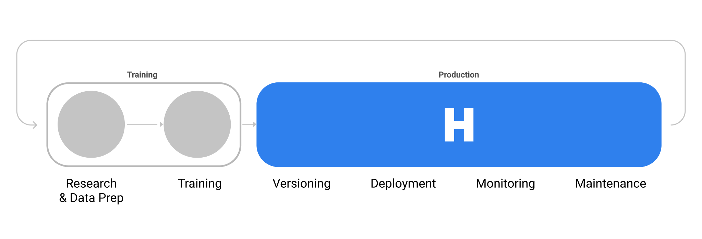

# Hydrosphere

Hydrosphere is a platform for **deploying, versioning and monitoring** your machine learning models in production. It is language-agnostic and framework-agnostic, with support for all major programming languages and frameworks - Python, Java, Tensorflow, Pytorch, etc.

What to do next?

1. ⭐️ Checkout and star [Hydrosphere Github Repo](https://github.com/Hydrospheredata/hydro-serving)
2. 💦 [Get started](getting-started.md) with Hydrosphere
3. 🥳 Become part of Hydrosphere Slack Community

