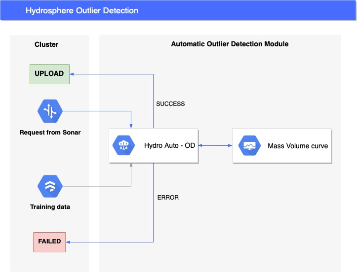

# Automatic Outlier Detection

**Anomaly detection** is focused on identifying data objects that are different from our expectations. It could be influenced by bad practices like noise, errors, or some unexpected events. Unusual data also can be due to rare, but correct, behavior, which often results in interesting findings, motivating further investigation. Because of these reasons, it is necessary to develop techniques that allow us to identify such unusual events. We assume that such events may induce some objects generated by a ”different mechanism”, which indicates that these objects might contain unexpected patterns that do not conform to normal behavior. 

From first sight, anomaly detection is perceived as a classification task to differentiate between normal and abnormal events. However, we usually have a very small number of such abnormalities or do not have them at all, which transforms the problem of outlier detection into the unsupervised context, the type of machine learning, a type of machine learning that looks for previously undetected patterns in a data set with no pre-existing labels and with a minimum of human supervision. For all those reasons it becomes very complicated to establish the most relevant outlier detection algorithm for each case. 

Hydrosphere has an engine inside that **automatically** creates an outlier detection metric for each model. The whole process consists of sequential steps and can be splitted up on several stages:

1. As a starting point, Hydrosphere utilizes a training data to check whether it has an approapriate format for each feature
2. Applying Mass Volume curve method to find an appropriate anomaly detection model based on the training data
3. Upload the model on the cluster and assign it as a anomaly detection metric to the initially trained model

As you might notice the core mechanism that makes a choice about the model is based on the  Mass Volume curve. This kind of metric might be assumed as **a performance metric** for unsupervised anomaly detection. You can learn more about this method and metric by this [link](https://arxiv.org/pdf/1607.01152.pdf). At the moment Hydrosphere makes a choice among three anomaly detection algorithms: Isolation Forest, Local Outlier Factor and One-Class Support Vector Machines. Additional models will be added later.

The last aspect of outlier detection algorithm is choosing an appropriate threshold. Most methods calculate outlier score for each object and then threshold the scores to detect outliers. Most widely used thresholding techniques are based on statistics like standard deviation around mean, median absolute deviation and interquartile range. Unfortunately, these statistics can be significantly biased because of the presence of outliers when calculating these statistics. In Hydropshere, we empirically decided to stay with 97th percentile. It means that a request is labeled as an outlier if the outlier score is greater than the 97th percentile of training data outlier scores distribution.

You can observe those models deployed as metrics in your monitoring dashboard. These metrics provide you with information about how novel/anomalous your data is. If these values of the metric deviate significantly from the average, you can tell that you experience some potential abnormality event. In the case, if you observe a gradually increasing number of such events, then it might be associated with a data drift, which makes a need to re-evaluate your ML pipeline to check for errors.

## Supported Models

Right now Auto OD feature works only for Models with numerical scalar fields and uploaded training data.

