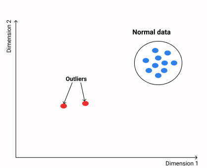
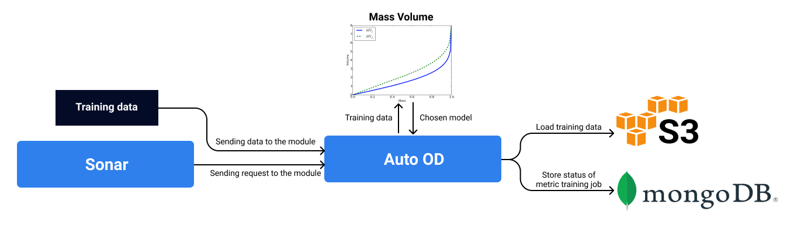

# Automatic Outlier Detection

**Anomaly detection** is focused on identifying data objects that are different from our expectations. It can be influenced by bad practices like noise, errors, or some unexpected events. Unusual data points can be also due to rare, but correct behaviour, which often results in interesting findings, motivating a further investigation. For these reasons, it is necessary to develop some techniques that could allow us to identify such unusual events. We assume that such events may induce some objects generated by a ”different mechanism”, which indicates that these objects might contain unexpected patterns that do not conform to a normal behaviour. 

For each model with uploaded training data, Hydrosphere creates an outlier detection \(Auto OD\) metric, which assigns an outlier score to each request. A request is labeled as an outlier if the outlier score is greater than the 97th percentile of training data outlier scores distribution.

At first sight, anomaly detection is perceived as a classification problem that differentiate between normal and abnormal events. But that's usually not the case, since abnormalities are not presented enough to be a separate labeled class or even might be completely absent, which transfers the problem of outlier detection into the unsupervised context, a type of machine learning that looks for previously undetected patterns in a dataset with no pre-existing labels and with a minimum of human supervision. Within these constraints we have no choice but to rely on **unsupervised machine learning** algorithms. Practically those algorithms should look at the data and model normal behaviour as good as possible. After this step they can detect potentially risky events, without having a priori knowledge of what malicious and benign behavior looks like, by checking if a new event is dissimilar enough from the baseline. 

But in order to make a right choice, it is essential to measure their performance in terms of specific metrics like accuracy, F1-score, ROC-AUC, etc. For this we would normally need labels that tell whether an event is in fact unusual. But, as we stated before, the data sets we are using do not have labels. How can we still estimate performance? For this purpose we can apply a metric, which is called Area Under Mass Volume curve, which was developd specifically for unsuprevised anomaly ranking. This kind of metric might be assumed as **a performance metric** similar to [ROC Curve](https://en.wikipedia.org/wiki/Receiver_operating_characteristic), but for unsupervised anomaly detection. Briefly speaking, MV measures the extent to which the spread of the distribution of anomaly score for training data differs from that of a randomly generated uniform distribution. You can learn more about this method as well as this metric by this [link](https://arxiv.org/pdf/1607.01152.pdf).

Hydrosphere has a specific engine inside the platform that automatically creates an outlier detection metric and assigns it to each downloaded model accordingly. The whole process can be divided into several consecutive stages:
1. As a starting point, Hydrosphere utilizes a training data to check whether it has an appropriate format for each feature
2. Then it applies the Mass Volume curve method to find an appropriate anomaly detection model. At the moment Hydrosphere chooses among three anomaly detection algorithms: Isolation Forest, Local Outlier Factor, and One-Class Support Vector Machines with prewitten set of hyperparameters. Additional models will be added later.
3. Finally, it uploads the chosen model on the cluster and assigns it as an anomaly detection metric to the previously trained model

There is an important aspect of outlier detection algorithm, which is concerned about choosing an appropriate threshold. Most outlier detection models calculate outlier score for each sample of the training data and then establishes a threshold score for detecting potential anomalies. In order to find this value, there exist several thresholding techniques, which based on statistics like standard deviation around the mean, median absolute deviation and interquartile range. Unfortunately, these statistics can be significantly biased because of the presence of potential outliers like noise or errors, when calculating these measures. In Hydropshere, we did some preliminary experiments with different datasets to find a value that maximize predictive ability for anomaly detection models and established that 97th percentile of raw outlier scores looks most promising. It means that a request is labeled as an outlier if its anomaly score is greater than that of the 97th percentile of training data outlier scores distribution. 

You can observe those assigned models deployed as metrics in your **Monitoring** dashboard. These metrics provide you with information about how novel/anomalous your data is. If these values of the metric deviate significantly from the common, you can tell that you experience some potential abnormality event. In the case, if you observe a gradually increasing number of such events, then it might be associated with a data drift, which makes a need to re-evaluate your ML pipeline to check for errors.

## High-dimensional cases

As mentioned above, outlier detection has turned out to be an import problem in many research fields. Still for high-dimensional data detecting such rare behaviors is not a trivial task. High dimensionality refers to data sets that have a large number of independent variables, components, features, or attributes within the data available for analysis. The complexity of the data analysis increases with respect to the number of dimensions, requiring more sophisticated methods to process the data. As a result, different methods might suffer from diffrent problems. For example, in the high-dimensional perspective, distane between observations might be very small, which will reduce the efficiency of distance-based outlier detection methods. Or, for high-dimensional data some irrelevant attributes may impede the separability of outliers from normal samples. Despite that for some 'big data' cases Hydrosphere's models are able to detect a critical anomalousness, it is not recommended to entirely rely on the results of Auto OD for **high-dimensional cases**. You can choose a specific algorithm that are more adapted for such cases. Hydrosphere Automatic Outlier Detection allows you to train your own model that is not a part of the Hydrosphere's engine. There is a specific [tutorial](https://app.gitbook.com/@hydrosphere/s/serving-docs/~/drafts/-MM0RBUUAdzlmw5OFY3B/quickstart/tutorials/custom_metric/) dedicated to a creation of you own custom outlier detection metric. As an example you can find couple of algorithms for this task, which are a part of the PyOD toolbox. 

- [Angle-based Outlier Detection (ABOD)](https://pyod.readthedocs.io/en/latest/pyod.models.html#module-pyod.models.abod)
- [Subspace Outlier Detection (SOD)](https://pyod.readthedocs.io/en/latest/pyod.models.html#module-pyod.models.sod)

For more details about high-dimensional problem and algorithms dedicated to overcome this problem you can read [here](https://www.sciencedirect.com/science/article/pii/B9780128133149000116?via%3Dihub).

## Supported Models

Right now Auto OD feature works only for Models with numerical scalar fields and uploaded training data.

