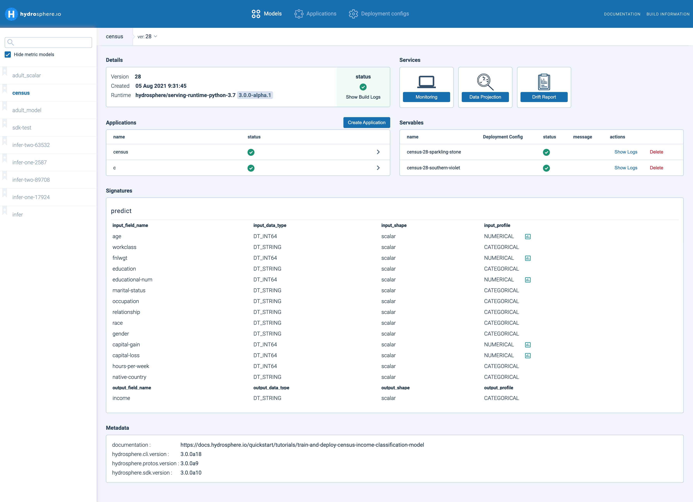

# Overview

## What is Hydrosphere?

Hydrosphere is an open-source MLOps platform for **deploying, managing, and monitoring ML models in production with Kubernetes.**

Hydrosphere supports all major machine learning frameworks, including Tensorflow, Keras, PyTorch, XGBoost, scikit-learn, fastai, etc. The platform is designed to effectively measure performance and health metrics of your production models, making it possible to spot early signs of performance drops and data drifts, get insights into why they happen.

Hydrosphere offers immediate value to ML-based products:

* Сovers all aspects of the production ML lifecycle - model versioning & deployment, traffic & contract management, data monitoring, gaining insights.
* Easy & fast management of production models that brings models to production in minutes by reducing time to upload, update, and roll your models into production. 
* Allows to create reproducible, observable, and explainable machine learning pipelines.
* Provides understanding and control of models’ performance in production via data and target metrics analysis.
* Adds in-depth observability for your production models and data flowing through them. 
* Improves business metrics of ML-based products as a result of a reduction in MTTR and MTTD incidents related to ML models due to early alerts once data drifts happen.

## Why Hydrosphere?

Production ML is a dangerous place where numerous things can and usually do go wrong, making issues harder to discover and fix. Hydrosphere automates MLOps in the production part of the ML lifecycle combining best practices of CI/CD and DevOps and putting special emphasis on monitoring performance of ML models after their deployment.

MLOps problems Hydrosphere addresses:

* Non-interpretable, biased models
* Integration between the tools of each step of production ML lifecycle
* Long time to find & debug issues with production ML Models
* Monitoring for Model Degradation and Performance Loss
* Understanding the reasons behind wrong predictions  

## What Hydrosphere is not

Hydrosphere is **not an ML model training framework**. Before using Hydrosphere, you need to train your models with one of many existing frameworks for ML model training.

We suggest you use one of the orchestrators, such as Kubeflow or Airflow, to deliver your model to the Hydrosphere.

## Hydrosphere Components

Hydrosphere platform includes all steps of a production ML model cycle - Versioning, Deployment, Monitoring, and Maintenance. This combination allows us to use a single tool to build an observable, reproducible, and scalable workflow, and start getting early warnings once anything goes wrong. These steps of an ML lifecycle are divided between three components that make up the Hydrosphere platform - Serving, Monitoring, and Interpretability.

### Serving

Hydro Serving is responsible for framework-agnostic model deployment and management. It allows Data Scientists to upload, version, combine into linear pipelines and deploy ML models trained in any ML framework to a Docker/Kubernetes cluster and expose HTTP/gRPC/Kafka API to other parties.

### Monitoring


Hydrosphere Monitoring is not available as an open-source solution. If you are interested in this component you can contact us via [gitter](https://gitter.im/Hydrospheredata/hydro-serving) or our [website](https://hydrosphere.io)


Hydro Monitoring tracks model performance over time, raising alerts in case of detected issues. It provides a real-time updated UI, where you can monitor your models to see service health and usage. This constant monitoring of model health is crucial for any ML-based business as it’s tied to business and financial metrics.

Hydrosphere is capable of monitoring model quality with or without getting additional labeled data. Labeled data is often used in production drawing conclusions about the quality of a model’s predictions. Sometimes it is hard to get labeled data in production in a timely and cost-effective manner, especially when you deal with large volumes of complex data. Hydrosphere circumvents this issue by analyzing data that flows through a model as a proxy evaluating model quality to detect if ML models start to degrade and make unreliable predictions due to production data drifts from training data.

### Interpretability


Hydrosphere Interpretability is not available as an open-source solution. If you are interested in this component you can contact us via [Gitter](https://gitter.im/Hydrospheredata/hydro-serving) or our [website](https://hydrosphere.io).


Hydrosphere Interpretability provides human-readable explanations of the predictions made by your ML models, as well as the explanations of monitoring analytics made by Hydrosphere Monitoring. It helps to evaluate and analyze models and understand what features influence their decisions. The Interpretability component demystifies your ML process, provides a new level of confidence about the reasons behind your models’ decisions and a certain level of trust business can rely on.

