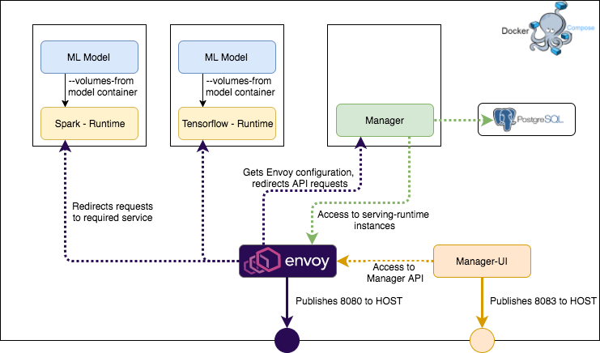

## Development environment



TBD

#### How to start
##### Export directory with models
```
export MODEL_DIRECTORY=/path/to/hydro-serving-runtime/models
```

##### Run docker-compose
```
docker-compose up
```

#### Resources
 - http://localhost:8080/swagger/swagger-ui.html - Swagger UI through Sidecar
 - http://localhost:8082 - Sidecar admin console
 - localhost:8080 - Sidecar Ingress Port for HTTP/GRPC requests
 - http://localhost:8083 - Manager UI