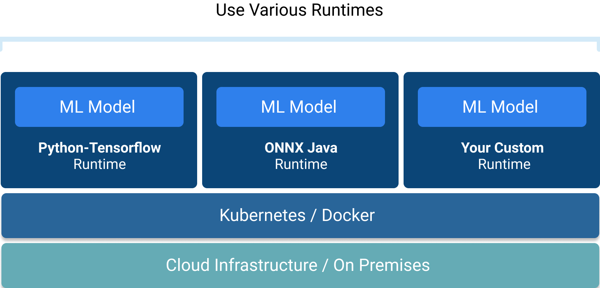

# Concepts

## Resource definitions

**Resource definitions** describe **Models**, **Applications**, and **Deployment Configurations** in the YAML format. You can learn more about them in the [How to write resource definitions](../how-to/write-definitions.md) section.

## Serving

### Models & Model Versions

A **Model** is a machine learning model or a processing function that consumes provided inputs and produces predictions or transformations.

Within the Hydrosphere platform, we break down a model into its versions. Each **Model version** represents a single Docker image containing all the artifacts that you have uploaded to the platform. Consequently, **Model** is a group of **Model versions** with the same name.


### Runtimes

A **Runtime** is a Docker image with the predefined gRPC interface which loads and serves your model.



We have [implemented](../reference/runtimes.md) a few runtimes, which you can use in your own projects.

### Servable

**Servable** is a deployed instance of a Model version combined with a Runtime. It exposes a gRPC endpoint that can be used to send requests.

Users should not use Servables as-is, since they are designed to be building blocks, rather than inference endpoints. Hydrosphere provides a better alternative to deploy a Model version — Application.

### Applications

An **Application** is a pipeline of one or more stages, each consisting of one or multiple Model Versions. Data sent to an application stage is shadowed to all of its model versions. The output of a stage is picked randomly with respect to weights.


When a user creates an Application, the Manager service automatically deploys appropriate Servables. The Application handles monitoring of your models and can perform A/B traffic splits.

Each Application has publicly available HTTP and gRPC endpoints that you can send requests to.

### Deployment Configurations

A **Deployment Configuration** is a collection of Kubernetes settings that you can set for your Servables and Model Versions used inside of Application stages.

Deployment Configuration covers:

* Horizontal Pod Autoscaler specs
* Container Specs 
  * Resource requirements: limits and requests 
* Pod Specs
  * Node Selectors
  * Affinity
  * Tolerations
* Deployment Specs
  * Replicas count

### Model's Signature

A **Model's** **Signature** is a specification of your model computation which identifies the name of a function with its inputs and outputs, including their names, shapes, and data types.

Example of a signature defined in a YAML file:

```yaml
contract:
  name: predict
  inputs:
    x:
      shape: [-1, 2]
      type: double
      profile: numerical
  outputs:
    y:
      shape: scalar
      type: int
      profile: categorical
```

#### Field

A **Field** is a basic element of a Model's signature. It has a name, shape, data type, and profile.

Example of a model's signature field defined in a YAML file:

```yaml
x:
  shape: [-1, 2]
  type: double
  profile: numerical
```

#### Field\`s Profile

A **Profile** is a special tag that tells how Hydrosphere should interpret the field's data.

There are multiple available tags: Numerical, Categorical, Image, Text, Audio, Video, etc.

## Monitoring

### Metrics

Data coming through deployed Model Versions can be monitored with metrics.

**Metric** is a Model Version that takes a combination of inputs & outputs from another monitored Model Version, receives every request and response from the monitored model, produces a single value, and compares it with a threshold to determine whether this request was healthy or not.

Every request is evaluated against all metrics assigned to the model.

**Auto OD Metric** is an automatically generated Outlier Detection metric. More details are described [here](hydrosphere-features/automatic-outlier-detection.md).

### Checks

A **check** is a boolean condition associated with a field of a Model Version signature which shows for every request whether the field value is acceptable or not.

For example, Min/Max checks ensure that a field value is in an acceptable range which is inferred from training data values.

### 

