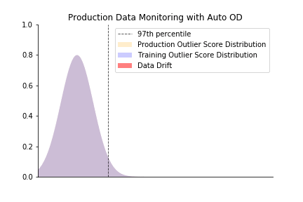

# Automatic Outlier Detection

For each model with uploaded training data, Hydrosphere creates an outlier detection metric, which assigns an outlier score to each request. Request is labelled as an outlier if the outlier score is greater than the 97th percentile of training data outlier scores distribution.  

You can observe those models deployed as metrics in your monitoring dashboard. These metrics provide you with information about how novel/anomalous your data is.

If these values of this metric deviate significantly from the average, you can tell that you experience a data drift and need to re-evaluate your ML pipeline to check for errors.

