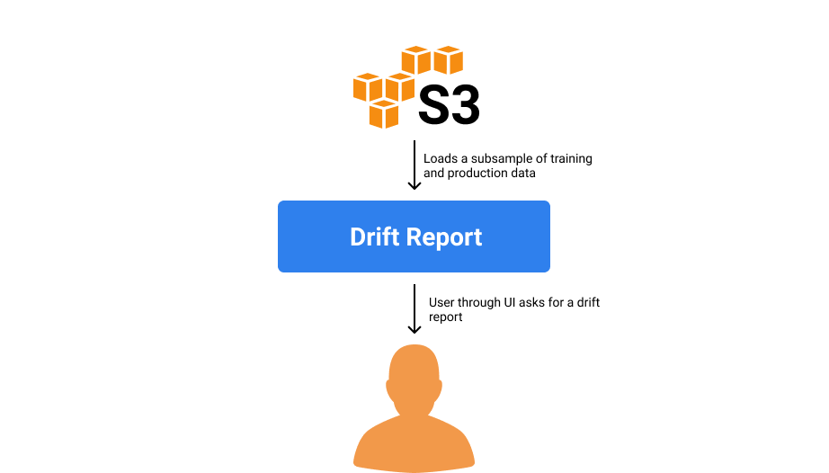

# Monitoring


Hydrosphere Monitoring is not available as an open-source solution. If you are interested in this component you can contact us via [gitter](https://gitter.im/Hydrospheredata/hydro-serving) or our [website](https://hydrosphere.io)


## Automatic Outlier Detection

## Sonar

Sonar service is responsible for managing metrics, training and production data storage, calculating profiles, and shadowing data to the Model Versions which are used as an outlier detection metrics.

## Drift Report

