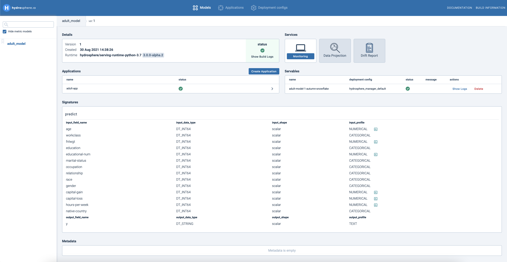
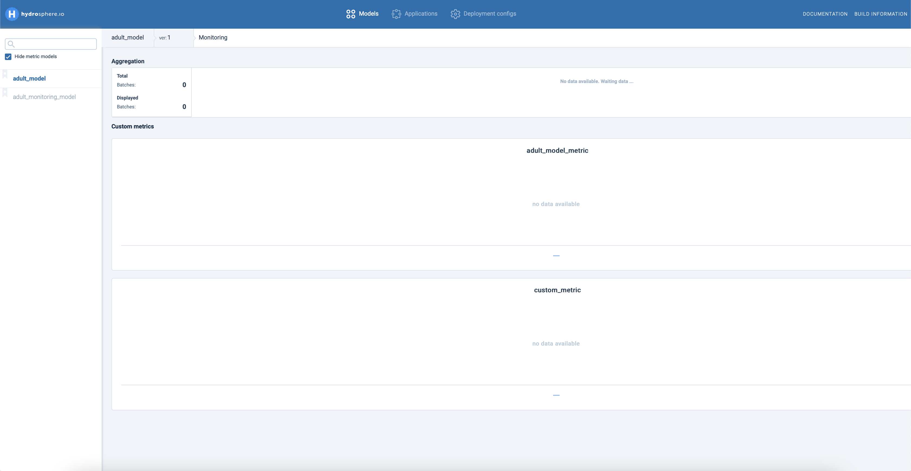

# Monitoring Anomalies with a Custom Metric

## Overview

In this tutorial, you will learn how to create a custom anomaly detection metric for a specific use case.

Let's take a problem described in the previous [Train & Deploy Census Income Classification Model](https://app.gitbook.com/@hydrosphere/s/home/~/drafts/-MHGvmrVrOLoZn1Rkock/tutorials/train-and-deploy-census-income-classification-model) tutorial as a use case and [census income dataset](https://www.kaggle.com/wenruliu/adult-income-dataset) as a data source. We will monitor a model that classifies whether the income of a given person exceeds $50.000 per year.

By the end of this tutorial you will know how to:

* Train a monitoring model 
* Deploy of a monitoring model with SDK
* Manage сustom metrics with UI
* Upload a monitoring model with CLI

## Prerequisites

For this tutorial, you need to have **Hydrosphere Platform** deployed and **Hydrosphere CLI** \(`hs`\) along with **Python SDK** \(`hydrosdk`\) _\*\*_installed on your local machine. If you don't have them yet, please follow these guides first:

* [Platform Installation](../installation/)
* [CLI](../installation/cli.md#installation)
* [Python SDK](../installation/sdk.md#installation) 

This tutorial is a sequel to the previous tutorial. Please complete it first to have a prepared dataset and a trained model deployed to the cluster:

* [Train & Deploy Census Income Classification Model](train-and-deploy-census-income-classification-model.md)

## Train a Monitoring Model

We start with the steps we used for the common model. First, let's create a directory structure for our monitoring model with an `/src` folder containing an inference script`func_main.py`. We also need training data used from the previous tutorial, which we can copy directly to just created directory:

```bash
mkdir -p monitoring_model/src
!cp model/train_adult.csv monitoring_model/
cd monitoring_model
touch src/func_main.py
```

As a monitoring metric, we will use **IsolationForest**. You can learn how it works [here](https://towardsdatascience.com/outlier-detection-with-isolation-forest-3d190448d45e). In this example we are going to use [PyOD](train-and-deploy-census-income-classification-model.md) library, which is dedicated specifically to anomaly detection algorithms. Let's install it first.

```bash
pip install pyod -U
```
The whole process is similar to what we are usually doing with common machine learning models. Let's import necessary libraries, train our outlier detection model and save it in our working directory. Specifically for training we are supposed to use the same training data as for our prediction model.

```python
import pandas as pd
from joblib import dump
import matplotlib.pyplot as plt
from pyod.models.iforest import IForest

X_train = pd.read_csv('train_adult.csv')

OD = IForest(contamination=0.03)

train_pred = OD.fit(X_train) 

train_scores = OD.predict_proba(X_train)

plt.hist(
    train_scores[:,1], 
    bins=30, 
    alpha=0.7, 
    density=True, 
    label="Test data outlier scores"
)

plt.vlines(1-OD.contamination, 0, 0.5, label = "Threshold")
plt.gcf().set_size_inches(8, 5)
plt.title('Outlier Scores')
plt.xlabel('Probability')
plt.ylabel('Frequency')
plt.legend()

joblib.dump(OD, "monitoring_model.joblib")
```


This is what the pprobability distribution of our inliers looks like. It is directly dependent upon the method you choose. In our case we have applied a `linear` conversion, which transforms outlier scores by the range of [0, 1] using Min-Max values. Remember that the model must be fitted first. By choosing a contamination parameter we can adjust a threshold that will separate inliers from outliers accordingly. You have to be thorough in choosing it to avoid critical prediction mistakes.  Otherwise, you can also stay with `'auto'`. To create a monitoring metric, we have to deploy that Isolation Forest model as a separate model on the Hydrosphere platform.

## Deploy a Monitoring Model with SDK

First, let's create a new directory where we will store our inference script with declared serving function and its definitions. Put the following code inside the `src/func_main.py` file:

```python
import numpy as np
from joblib import load

monitoring_model = load('/model/files/monitoring_model.joblib')

features = ['age', 'workclass', 'fnlwgt',
            'education', 'educational-num', 'marital-status',
            'occupation', 'relationship', 'race', 'gender',
            'capital-gain', 'capital-loss', 'hours-per-week',
            'native-country']

def predict(**kwargs):
    x = np.array([kwargs[feature] for feature in features]).reshape(1, len(features))
    predicted = monitoring_model.predict_proba(x)[:,1]

    return {"value": predicted.item()}
```

Next, we need to install the necessary libraries. Create a `requirements.txt` and add the following libraries to it:

```bash
joblib==0.13.2
numpy==1.16.2
scikit-learn==0.23.1
```

Just like with common models, we can use SDK to upload our monitoring model and bind it to the trained one. The steps are almost the same, but with some slight differences: 
1. First, since we want to predict the anomaly score instead of sample class, we need to change the type of output field from `'str'` to `'float64'`
2. Next we need to find our model on the cluster before assigning it to our prediction model. There is a specific method called `.find()` inside `ModelVersion` class
3. Finally, we need to apply a couple of new methods to create a metric. `MetricSpec` is responsible for creating a metric for a specific model, with specific `MetricSpecConfig`, which describe parameters of our metric like probability threshold and principle by which metric should detect outliers. In this case, `.LESS` denotes that every value below provided threshold is defined as an inlier.

```python
from hydrosdk.monitoring import MetricSpec, MetricSpecConfig, ThresholdCmpOp
from hydrosdk.signature import SignatureBuilder
from hydrosdk.modelversion import ModelVersion, ModelVersionBuilder, DockerImage


path_mon = "."
payload_mon = ['src/func_main.py', 
               'monitoring_model.joblib', 'requirements.txt']

monitoring_signature = SignatureBuilder('predict') 
for i in X_train.columns:
    monitoring_signature.with_input(i, 'int64', 'scalar')
monitor_signature = monitoring_signature.with_output('value', 'float64', 'scalar').build()

model_find = ModelVersion.find(cluster, "adult_model", adult_model.version)
monitoring_model_local = ModelVersionBuilder("adult_monitoring_model", path_mon) \
    .with_install_command("pip install -r requirements.txt") \
    .with_payload(payload_mon) \
    .with_signature(monitor_signature) \
    .with_runtime(DockerImage.from_string("hydrosphere/serving-runtime-python-3.7:3.0.0-alpha.2"))

monitoring_upload = monitoring_model_local.build(cluster)
monitoring_upload.lock_till_released()
metric_config = MetricSpecConfig(monitoring_upload.id, monitoring_model.offset_, ThresholdCmpOp.LESS)
metric_spec = MetricSpec.create(cluster, "custom_metric", model_find.id, metric_config)
```

Anomaly scores are obtained through [traffic shadowing](../../about/hydrosphere-features/traffic-shadowing.md) inside the Hydrosphere's engine after making a Servable, so you don't need to perform any additional manipulations.

## Managing Custom Metrics with UI

Go to the UI to observe and manage all your models. Here you will find 3 models on the left panel:

* `adult_model` - a model that we trained for prediction in the [previous tutorial](train-and-deploy-census-income-classification-model.md#training-a-model)
* `adult_monitoring_model` - our monitoring model  
* `adult_model_metric` - a model that was created by Automatic Outlier Detection 



Click on the trained model and then on Monitoring. On the monitoring dasboard you now have two external metrics: the first one is `auto_od_metric` that was automatically generated by [Automatic Outlier Detection](https://app.gitbook.com/@hydrosphere/s/home/~/drafts/-MHLfibGIoeUmdpQR30S/overview/features/automatic-outlier-detection), and the new one is `custom_metric` that we have just created. You can also change settings for existing metrics and configure the new ones in the `Configure Metrics` section:



During the prediction, you will get anomaly scores for each sample in the form of a chart with two lines. The curved line shows scores, while the horizontal dotted one is our threshold. When the curve intersects the threshold, it might be a sign of potential anomalousness. However, this is not always the case, since there are many factors that might affect this, so be careful about your final interpretation.


## Uploading a Monitoring model with CLI

Just like in the case with all other types of models, we can define and upload a monitoring model using a resource definition. We have to pack our model with a model definition, like in the previous tutorial.

```yaml
kind: Model
name: "adult_monitoring_model"
payload:
  - "src/"
  - "requirements.txt"
  - "monitoring_model.joblib"
runtime: "hydrosphere/serving-runtime-python-3.7:3.0.0-alpha.2"
install-command: "pip install -r requirements.txt"
contract:
  name: "predict"
  inputs:
    age:
      shape: scalar
      type: int64
    workclass:
      shape: scalar
      type: int64
    education:
      shape: scalar
      type: int64
    marital_status:
      shape: scalar
      type: int64
    occupation:
      shape: scalar
      type: int64
    relationship:
      shape: scalar
      type: int64
    race:
      shape: scalar
      type: int64
    sex:
      shape: scalar
      type: int64
    capital_gain:
      shape: scalar
      type: int64
    capital_loss:
      shape: scalar
      type: int64
    hours_per_week:
      shape: scalar
      type: int64
    country:
      shape: scalar
      type: int64
    classes:
      shape: scalar
      type: int64
  outputs:
    value:
      shape: scalar
      type: float64
```

Inputs of this model are the inputs of the target monitored model plus the outputs of that model. We will use the `value` field as an output for the monitoring model. The final directory structure should look like this:

```text
.
├── monitoring_model.joblib
├── requirements.txt
├── serving.yaml
└── src
    └── func_main.py
```

From that folder, upload the model to the cluster:

```bash
hs apply -f serving.yaml
```

Now we have to attach the deployed Monitoring model as a custom metric. Let's create a monitoring metric for our pre-deployed classification model in the UI:

1. From the _Models_ section, select the target model you would like to deploy and select the desired model version.
2. Open the _Monitoring_ tab.
3. At the bottom of the page click the `Configure Metric` button.
4. From the opened window click the `Add Metric` button.
   1. Specify the name of the metric.
   2. Choose the monitoring model.
   3. Choose the version of the monitoring model.
   4. Select a comparison operator `Greater`. This means that if you have a metric value greater than a specified threshold, an alarm should be fired.
   5. Set the threshold value. In this case, it should be equal to the value of `monitoring_model.threshold_`.
   6. Click the `Add Metric` button.

That's it. Now you have a monitored income classifier deployed on the Hydrosphere platform.
