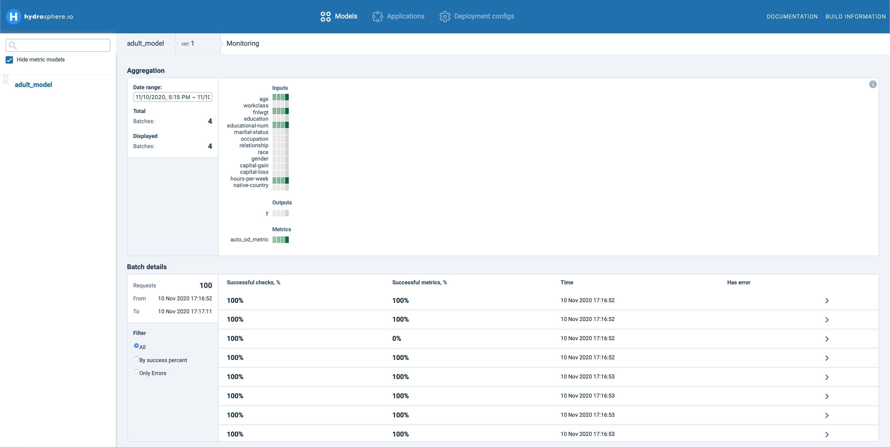
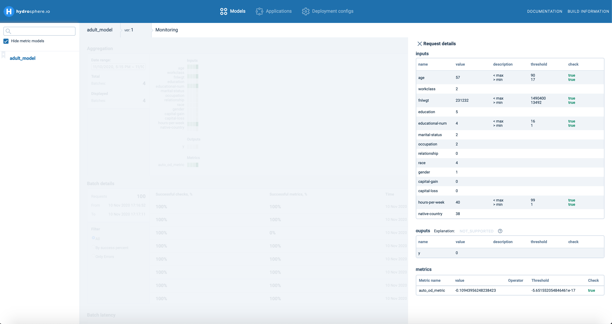
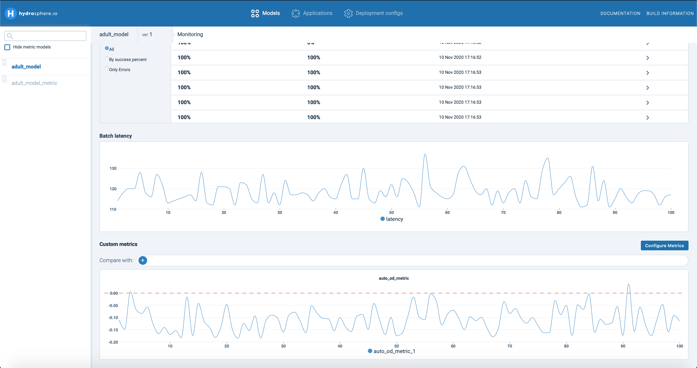

# Using Automatic Outlier Detection to find anomalies

This guideline is dedicated to an anomaly detection service for a launched model. If you haven't finished this stage, please check our previous [guide](https://app.gitbook.com/@hydrosphere/s/home/~/drafts/-MHGvmrVrOLoZn1Rkock/tutorials/train-and-deploy-census-income-classification-model). As the first step, let's check our working interface by clicking your model on the left.


Here you can find all the general information about your servables, signatures, and services. 

At the moment Hydrosphere allows you to track information concerning your production dataflow. It allows you to monitor possible data drift, construct data projections for visualization, and detect possible anomalies in your data. Hydrosphere automatically provides an outlier detection model based on your training data. To start working with anomaly detection, click the Monitoring section.


Here you can observe all your monitor metrics assigned to your production model, configure new metrics, and observe results of monitoring. In this guide, we will consider only outlier detection metrics created automatically by Hydrosphere, which is called 'auto\_od\_metric' in our case. Let's try to process some data samples. Simply we can randomly take some number of samples, e.g. 400,  from the test part of Adult Dataset.

```python
results = []
for x in test_X.to_dict('records')[:400]:
    result = predictor.predict(x)
    results.append(result['y'])
```

Now you can observe some changes at UI sections. Each section provides some specific information about dataflow processing. Aggregation shows the correspondence of each feature to some metric, e.g. whether a feature value is in the min-max interval of your training data.



The Metrics subsection is responsible for providing an aggregated result for processing all samples in a batch by all assigned metrics. In Hydrosphere is it used a graphic scale, where green color \(\) means that all samples are successfully checked, whereas colors like yellow, orange and red \(,\) would indicate that you have significantly many potenial anomalies.

Batch details show basic information about processed batch like the success of processing for each sample, where 100% means that all metrics have processed each sample successfully. For outlier detection, it could indicate that the sample is not an outlier. You can click on each sample to check the value for each variable, predicted class as well as the score for all external metrics.



Additionally, Monitoring constructs a graph separately for each metric. Here you can observe the accumulated graph for each batch accordingly.



For 'auto\_od\_metric' Hydrosphere provides a line graph of outlier score for each sample together with a threshold value. The threshold is calculated automatically inside the Hydrosphere engine \(see Automatic Outlier Detection section\). Still, you can configure a custom metric by clicking on the Configure Metrics section. Details are provided in the next chapter.

