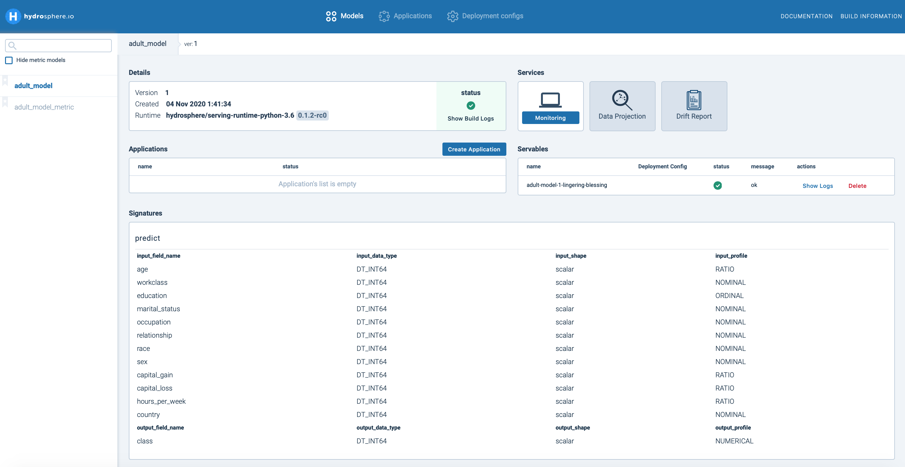
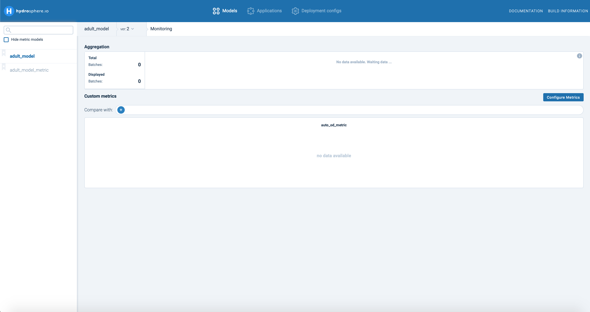
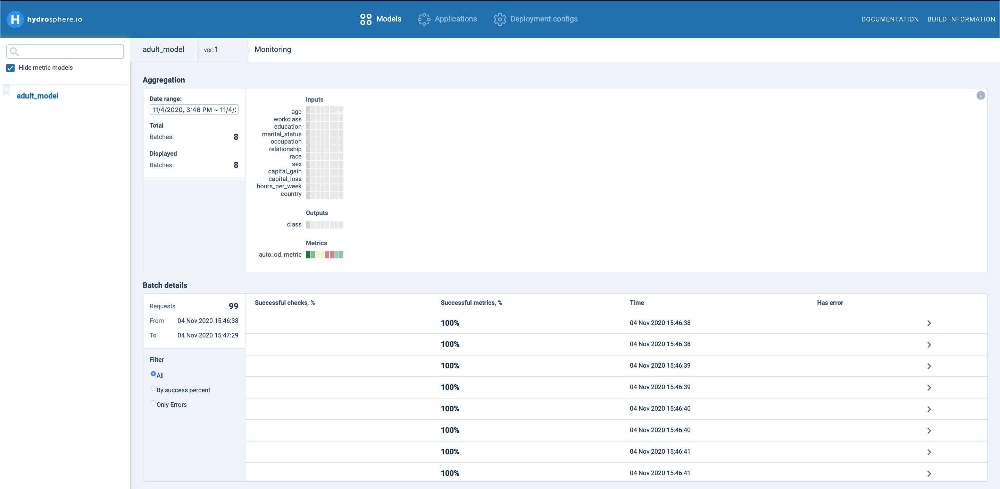
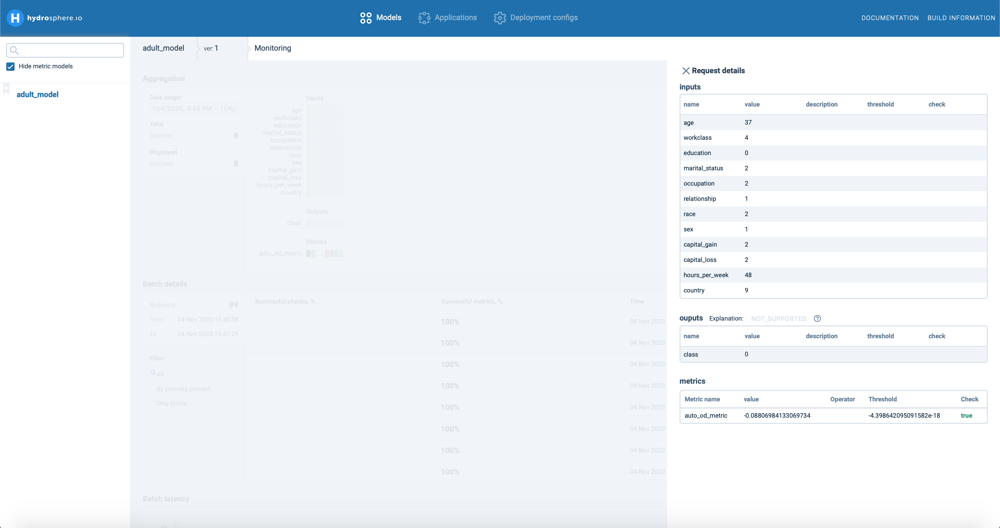
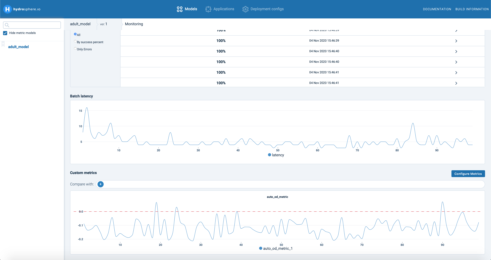

# How to use Anomaly Detection

This guideline is dedicated to a anomaly detection service for a laucned model. If you haven't finished this stage, please check our previous [guide](https://app.gitbook.com/@hydrosphere/s/home/~/drafts/-MHGvmrVrOLoZn1Rkock/tutorials/train-and-deploy-census-income-classification-model). As the first step, let's check our working interface by clicking your model on the left.

Here you can find all general information about your servables, signatures and services. At the moment Hydrosphere allows you tracking information concerning your production dataflow. It allows to you to monitor possible data drift, construct data projections for visualization and detect possible anomalies in your data. Hydrosphere automatically provides an outlier detection model based on your training data. To start woking with anomaly detection, click Monitoring section.

Here you can observe all your monitor metrics assigned to your production model, configure new metrics and observe results of monitoring. In this guide we will consider only outlier detection metrics created automatically by Hydrosphere, which is called 'auto\_od\_metric' in our case. Let's try to process some data samples.

Now you can observe some changes at UI sections. Each section provides some specific information about dataflow processing. Aggregation shows the correspondence of each feature to some metric, e.g. whether a feature value is in the min-max interval of your training data. Metrics subsection is responsible for providing an aggregated result for processing all samples in a batch by all assigned metrics. In Hydrosphere is it used a graphic scale, where green color means that all samples are successfully checked, whereas red are not. For outlier detection this might be associated with anomalousness of major part of samples.

Batch details show basic information about processed batch like success of processing for each sample, where 100% means that all metrics have processed each sample succesfully. For outlier detection it could indicate that sample is not an outlier. You can click on each sample to check value for each variable, predicted class as well as score for all external metrics.

Additionally Monitoring constructs a graph separately for each metric. Here you can observe the accumulated graph for each batch accordingly.

For 'auto\_od\_metric' Hydroshpere provides a line graph of outlier score for each sample together with a threshold value. Threshold is calculated automatically inside the Hydrosphere engine. Still you can configure a custom metric by clicking on Configure Metrics section. Details are provided in the next chapter.

