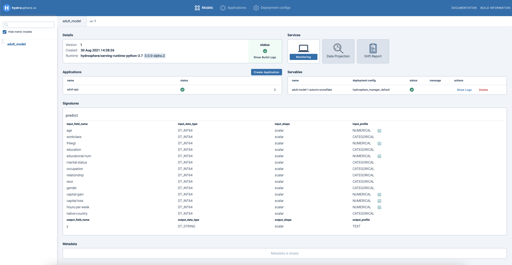

# Train & Deploy Census Income Classification Model

## Overview

In this tutorial, you will learn how to train and deploy a model for a classification task based on the [Adult Dataset](https://www.kaggle.com/wenruliu/adult-income-dataset). The whole process consists of such steps as preparation, model training, uploading a model to the cluster and making a prediction on test samples.

By the end of this tutorial you will know how to:

* Prepare data
* Train a model
* Deploy a model with SDK
* Explore models via UI
* Deploy a model with CLI and resource definition

## Prerequisites

For this tutorial, you need to have **Hydrosphere Platform** deployed and **Hydrosphere CLI** \(`hs`\) along with **Python SDK** \(`hydrosdk`\) installed on your local machine. If you don't have them yet, please follow these guides first:

* [Platform Installation](../installation/)
* [CLI](../installation/cli.md#installation)
* [Python SDK](../installation/sdk.md#installation) 

For this tutorial, you can use a local cluster. To ensure that, run `hs cluster` in your terminal. This command shows the name and server address of a cluster you’re currently using. If it shows that you're not using a local cluster, you can configure one with the following commands:

```text
hs cluster add --name local --server http://localhost
hs cluster use local
```

## Data preparation

Let's start with downloading the dataset and moving it to some folder, e.g. it could be `data/` folder. Next you need to setup your working environment using the following packages:

```text
numpy==1.18.3
pandas==1.3.1
scikit-learn==0.24.2
hydrosdk==3.0.0
tqdm
```

Model training always requires some amount of initial preparation, most of which is data preparation. Basically, the Adult Dataset consists of 14 descriptors, 5 of which are numerical and 9 categorical, including a class column. Categorical features are usually presented as strings. This is not an appropriate data type for sending it into a model, so we need to transform it first. Note that we apply a specific type \(`int64`\) for OrdinalEncoder to obtain integers for categorical descriptors after transformation. Transforming the class column usually is not necessary. Also we can remove rows that contain question marks in some samples. Once the preprocessing is complete, you can delete the DataFrame \(`df`\):

```python
import pandas as pd
import numpy as np
from sklearn.preprocessing import OrdinalEncoder


df = pd.read_csv('adult.csv', sep = ',').replace({'?':np.nan}).dropna()
categorical_encoder = OrdinalEncoder(dtype='int64')
categorical_features = ["workclass", "education", "marital-status", 
                        "occupation", "relationship", "race", "gender", 
                        "native-country"]

numerical_features = ['age', 'fnlwgt', 'educational-num', 
                      'capital-gain', 'capital-loss', 'hours-per-week']

df[categorical_features] = categorical_encoder.fit_transform(df[categorical_features])

X, y = df.drop('income', axis = 1), df['income']

del df
```

## Training a model

There are many classifiers that you can potentially use at this stage. In this example, we’ll apply Random Forest classifier. After preprocessing, the dataset will be separated into train and test subsets. The test set will be used to check whether our deployed model can process requests on the cluster. Training step usually requires iniating your model class and applying a specific training method, which is `fit()` method in our case. After the training step, we can save a model with `joblib.dump()` in a `model/` model folder. Training data can be saved as a `csv` file, but don't forget to place `index=False` to ignore index column and avoid further confusions with reading it again.

```python
 from sklearn.ensemble import RandomForestClassifier
 from sklearn.model_selection import train_test_split
 import joblib 

 train_X, test_X, train_y, test_y = train_test_split(X, y.astype(int), 
                                                    stratify=y,
                                                    test_size=0.2, 
                                                    random_state=random_seed)
 clf = RandomForestClassifier(n_estimators=20, 
                              max_depth=10,
                              n_jobs=5, 
                              random_state=random_seed).fit(train_X, train_y)

 joblib.dump(clf, 'model/model.joblib')
 train_X.to_csv('model/train_adult.csv', index = False)
```

## Deploy a model with SDK

The easiest way to upload a model to your cluster is by using [Hydrosphere SDK](https://hydrospheredata.github.io/hydro-serving-sdk/). SDK allows Python developers to configure and manage the model lifecycle on the Hydrosphere platform. Before uploading a model, you need to connect to your cluster:

```python
from hydrosdk.cluster import Cluster
from grpc import ssl_channel_credentials


cluster = Cluster("http-cluster-address", 
                 grpc_address="grpc-cluster-address",
                 grpc_credentials=ssl_channel_credentials())
```

Next, we need to create an inference script to be uploaded to the Hydrosphere platform. This script will be executed each time you are instantiating a model [servable](../../about/concepts.md#servable). Let's name our function file `func_main.py` and store it in the `src` folder inside the directory where your model is stored. Your directory structure should look like this:

```python
.
└── model
    └── model.joblib
    └── src
        └── func_main.py
```

The code in the `func_main.py` should be as follows:

```python
import pandas as pd
from joblib import load


clf = load('/model/files/model.joblib')

cols = ['age', 'workclass', 'fnlwgt',
 'education', 'educational-num', 'marital-status',
 'occupation', 'relationship', 'race', 'gender',
 'capital-gain', 'capital-loss', 'hours-per-week',
 'native-country']

def predict(**kwargs):
    X = pd.DataFrame.from_dict({'input': kwargs}, 
                               orient='index', columns = cols)
    predicted = clf.predict(X)

    return {"y": predicted[0]}
```

It’s important to make sure that variables will be in the right order after we transform our dictionary for a prediction. For that purpose in `cols` we preserve column names as a list sorted by order of their appearance in the DataFrame.

To start working with the model in a cluster, we need to install the necessary libraries used in `func_main.py`. You need to create `requirements.txt` in the folder with your model and add the following libraries to it:

```text
numpy==1.18.3
pandas==1.3.1
scikit-learn==0.24.2
```

After this, your model directory with all necessary dependencies should look as follows:

```python
.
└── model
    └── model.joblib
    └── requirements.txt
    └── src
        └── func_main.py
```

Now we are ready to upload our model to the cluster.

Hydrosphere Serving has a strictly typed inference engine, so before uploading our model we need to specify it’s signature with `SignatureBuilder`. A [signature](https://github.com/Hydrospheredata/hydro-serving/tree/cd9bb820a8c330e5a16dd600dbf985fe946c9982/docs/quickstart/overview/concepts.md#models-signature) contains information about which method inside the `func_main.py` should be called, as well as shapes and types of its inputs and outputs. You can use `X.dtypes` to check what types of data you have for each column. You can use `int64` fields for all our independent variables after transformation. Our class variable \(`income`\) initially consists of two classes with text names instead of numbers, which means that it should be defined as the string \(`str`\) in the signature. In addition, you can specify the type of profiling for each variable using `ProfilingType` so Hydrosphere could know what this variable is about and analyze it accordingly. For this purpose, we can create a dictionary, which could contain keys as our variables and values as our profiling types. Otherwise, you can describe them one by one as a parameter in the input. Finally, we can complete our signature with assigning our output variable by `with_output` method and giving it a name \(e.g. `y`\), type, shape and profiling type. Afterwards we can build our signature by the `build()` method.

```python
from hydrosdk.signature import SignatureBuilder, ProfilingType as PT

signature = SignatureBuilder('predict') 

col_types = {
  **dict.fromkeys(numerical_features, PT.NUMERICAL), 
  **dict.fromkeys(categorical_features, PT.CATEGORICAL)}

for i in X.columns:
    signature.with_input(i, 'int64', 'scalar', col_types[i])

signature = signature.with_output('y', 'str', 'scalar', PT.TEXT).build()
```

Next, we need to specify which files will be uploaded to the cluster. We use `path` variable to define the root model folder and `payload` to point out paths to all files that we need to upload. At this point, we can combine all our efforts by using `ModelVersionBuilder`object, which describes our models and other objects associated with models before the uploading step. It has different methods that are responsible for assigning and uploading different components. For example, we can:

1. Specify [runtime](https://github.com/Hydrospheredata/hydro-serving/tree/cd9bb820a8c330e5a16dd600dbf985fe946c9982/docs/quickstart/overview/concepts.md#runtimes) environment for our model by `with_runtime` method
2. Assign priorly built signature by `with_signature()`
3. Upload model's elements by `with_payload()`
4. Lastly, upload traning data that was previously applied for your model's traininig process by `with_trainig_data()`. Please note that the training data is **required** if you want to utilize various services as **Data Drift**, **Automatic Outlier Detection** and **Data Visualization**.

```python
from hydrosdk.modelversion import ModelVersionBuilder
from hydrosdk.image import DockerImage

path = "model/"
payload = ['src/func_main.py', 'requirements.txt', 'model.joblib']

local_model = ModelVersionBuilder("adult_model", path) \
    .with_install_command('pip install -r requirements.txt') \
    .with_signature(signature) \
    .with_runtime(DockerImage.from_string("hydrosphere/serving-runtime-python-3.7:3.0.0)) \
    .with_training_data('train_adult.csv') \
    .with_payload(payload)
```

Now we are ready to upload our model to the cluster. This process consists of several steps:

1. Once `ModelVersionBuilder`is prepared we can apply the `upload` method to upload it.
2. Then we can lock any interaction with the model until it will be successfully uploaded.
3. `ModelVersion` helps to check whether our model was successfully uploaded to the platform by looking for it.

```python
from hydrosdk.modelversion import ModelVersion

uploaded_model = local_model.upload(cluster)
uploaded_model.lock_till_released()
uploaded_model.upload_training_data()

adult_model = ModelVersion.find(cluster, name="adult_model", 
                               version=uploaded_model.version)
```

To deploy a model you should create an [Application](https://hydrosphere.gitbook.io/home/overview/concepts#applications) - a linear pipeline of `ModelVersions` with monitoring and other benefits. For that purpose, we are able to apply `ExecutionStageBuilder`, which describes the model pipeline for an application. In turn, applications provide [Predictor](https://hydrospheredata.github.io/hydro-serving-sdk/hydrosdk/hydrosdk.predictor.html) objects, which should be used for data inference purposes. Don't pay much attention to `weight` parameter, it is needed for A/B testing.

```python
from hydrosdk.application import ExecutionStageBuilder, ApplicationBuilder

stage = ExecutionStageBuilder().with_model_variant(adult_model, weight=100).build()
app = ApplicationBuilder("adult-app").with_stage(stage).build(cluster)
app.lock_while_starting()
predictor = app.predictor()
```

Predictors provide a `predict` method which we can use to send our data to the model. We can try to make predictions for our test set that has preliminarily been converted to a list of dictionaries. You can check the results using the name that we have used for an output of Signature and preserve it in any format you would prefer. Before making a prediction don't forget to make a small pause to finish all necessary loadings.

```python
from tqdm import tqdm

results = []
for x in tqdm(test_X.to_dict('records')):
    result = predictor.predict(x)
    results.append(result['y'])
print(results[:10])
```

## Explore the UI

If you want to interact with your model via Hydrosphere UI, you can go to `http://localhost`. Here you can find all your models. Click on a model to view some basic information about it: versions, building logs, created applications, model's environments, and other services associated with deployed models.

You might notice that after some time there appears an additional model with the `metric` postscript at the end of the name. This is your automatically formed monitoring model for outlier detection. Learn more about the Automatic Outlier Detection feature [here](https://hydrosphere.gitbook.io/home/overview/features/automatic-outlier-detection).



🎉 You have successfully finished this tutorial! 🎉

## Next Steps

Next, you can:

1. Go to the next [tutorial](https://docs.hydrosphere.io/quickstart/tutorials/custom_metric) and learn how to create a custom Monitoring Metric and attach it to your deployed model.
2. Explore the extended part of this tutorial to learn how to use YAML resource definitions to upload a ModelVersion and create an Application.  

### Deploy a model with CLI and Resource Definitions

Another way to upload your model is to apply a [resource definition](../../about/concepts.md#resource-definitions). This process repeats all the previous steps like data preparation and training. The difference is that instead of SDK, we are using CLI to apply a resource definition.

A [resource definition](../../about/concepts.md#resource-definitions) is a file that defines the inputs and outputs of a model, a signature function, and some other metadata required for serving. Go to the root directory of the model and create a `serving.yaml` file. You should get the following file structure:

```python
.
└── model
    └── model.joblib
    └── serving.yaml
    └── requirements.txt
    └── src
        └── func_main.py
```

Model deployment with a resource definition repeats all the steps of that with SDK, but in one file. A considerable advantage of using a resource definition is that besides describing your model it allows creating an application by simply adding an object to the contract after the separation line at the bottom. Just name your application and provide the name and version of a model you want to tie to it.

```yaml
kind: Model
name: "adult_model"
payload:
  - "model/src/"
  - "model/requirements.txt"
  - "model/classification_model.joblib"
runtime: "hydrosphere/serving-runtime-python-3.7:3.0.0"
install-command: "pip install -r requirements.txt"
training-data: data/profile.csv
contract:
  name: "predict"
  inputs:
    age:
      shape: scalar
      type: int64
      profile: numerical
    workclass:
      shape: scalar
      type: int64
      profile: categorical
    fnlwgt:
      shape: scalar
      type: int64
      profile: numerical
    education:
      shape: scalar
      type: int64
      profile: categorical
    educational-num:
      shape: scalar
      type: int64
      profile: numerical
    marital_status:
      shape: scalar
      type: int64
      profile: categorical
    occupation:
      shape: scalar
      type: int64
      profile: categorical
    relationship:
      shape: scalar
      type: int64
      profile: categorical
    race:
      shape: scalar
      type: int64
      profile: categorical
    sex:
      shape: scalar
      type: int64
      profile: categorical
    capital_gain:
      shape: scalar
      type: int64
      profile: numerical
    capital_loss:
      shape: scalar
      type: int64
      profile: numerical
    hours_per_week:
      shape: scalar
      type: int64
      profile: numerical
    country:
      shape: scalar
      type: int64
      profile: categorical
  outputs:
    class:
      shape: scalar
      type: int64
      profile: numerical
---
kind: Application
name: adult_application
singular:
  model: adult_model:1
```

To start uploading, run `hs apply -f serving.yaml`. To monitor your model you can use Hydrosphere UI as was previously shown.

