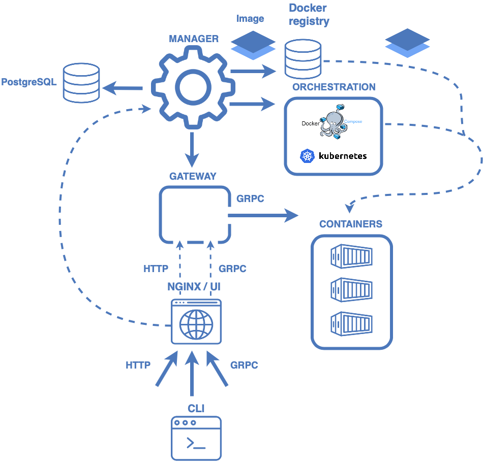

# Components

@@@ index
* [CLI](cli.md)
* [Monitoring](monitoring.md)
* [Model runtimes](runtimes.md)
@@@

# Cluster components 
## Manager service
[Manager](https://github.com/Hydrospheredata/hydro-serving-manager) is a service component, responsible for model cataloging, building, working with
model metadata and basically handling all resources.

### PostgreSQL
Database that contains such information as model (application) id, name, runtime type, etc. Manager creates, deletes or retrieves information about necessary model/application. 
### Docker Registry
Manager creates a Docker images which are stored in Docker registry.
An image is a read-only template with instructions for creating a Docker container.
### Orchestrators
When Manager wants to start container to run a certain model, it invokes orchestrator (Docker compose/Kubernetes)
 and provides it with Docker image from Docker registry.

## Gateway service
[Gateway](https://github.com/Hydrospheredata/hydro-serving-gateway) is a service component responsible for handling prediction requests and
routing them among model services. Gateway maps servable name to corresponding running container. Whenever it receives a request it communicates with corresponding container by grpc protocol. 

# Local Components
## Nginx/ UI service
Is responsible for handling http/grpc requests from CLI or outside.
## CLI 
CLI is a command line interface to varios services. More on [hs CLI](cli.md)

