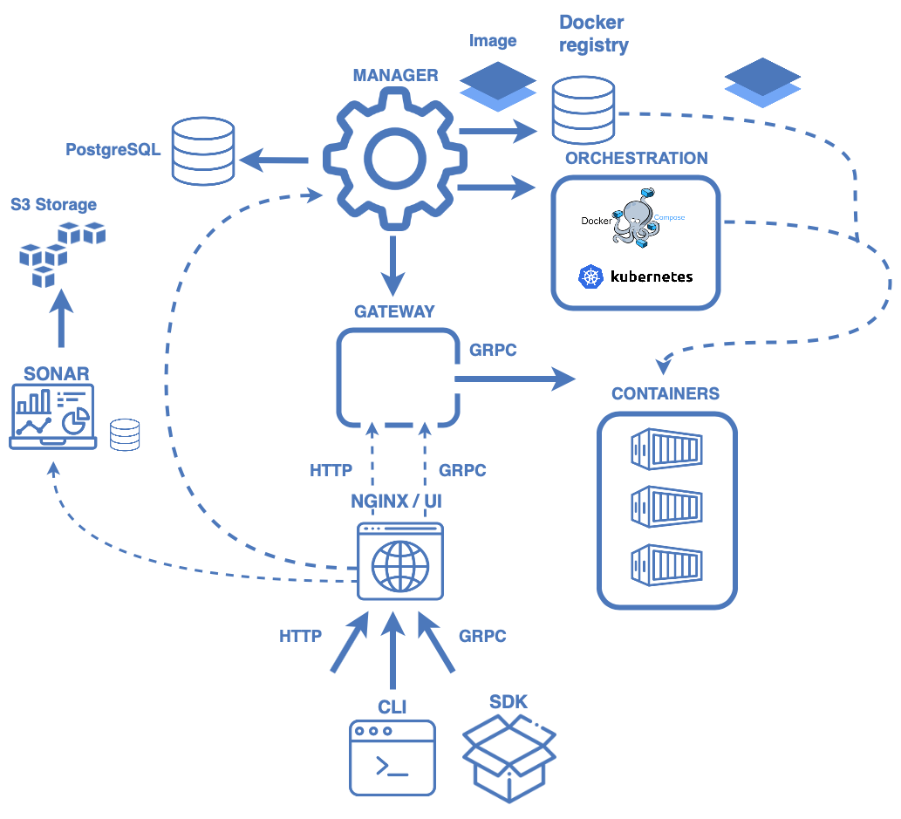

# Concepts

@@@ index
* [Model](models.md)
* [Application](applications.md)
* [Monitoring](monitoring.md)
@@@

Hydrosphere platform can be summarized in the following diagram. It's a 
set of microservices that work together to let you manage machine learning 
models reliably and at scale.  

## Services 

### Manager

[Manager](https://github.com/Hydrospheredata/hydro-serving-manager)
is a service component, responsible for model cataloging, building, 
provisioning servables and applications, working with models metadata and 
basically handling all the resources.

### Docker Registry

Each model is represented as a Docker image. Those images are stored
in the configured Docker registry. Hydrosphere can use the default 
registry bundled with the Hydrosphere installation or use external 
one.

### PostgreSQL

Hydrosphere stores information about models, applications, runtimes 
inside PostgreSQL database. 

### Gateway 

[Gateway](https://github.com/Hydrospheredata/hydro-serving-gateway) 
is a service component responsible for handling prediction requests and 
routing them among model services. Gateway maps model endpoint name to 
the corresponding container. Whenever it receives a request it communicates 
with that container by gRPC protocol.

### UI

[UI](https://github.com/Hydrospheredata/hydro-serving-ui) is a service 
component responsible for showing off user-friendly interfaces of models, 
deployed applications as well as monitoring charts and profiles. 

### Sonar

Sonar is a service component responsible for monitoring your models during 
inference time. It allows you to evaluate how your model behaves under 
production load, i.e. is there a concept drift occurred in the production data 
(so your model needs to be retrained); how many outliers are there in the 
production data; how distribution of your training data is compared with the 
distribution of the production data?

To learn more about how Sonar works, refer to @ref[this page](monitoring.md).

@@@ note
Currently not available in public distribution. 
@@@

## Abstractions

During the interaction with the platform you will encounter with the following 
entities: Models and Applications.

### Models

Model is a machine learning model or a processing function that consume 
provided inputs and produce predictions/transformations. To learn more about 
models visit [this page](models.md). 

### Applications

Application is a publicly available HTTP/gRPC/Kafka endpoint to reach your 
models. To learn more about applications visit [this page](applications.md). 
