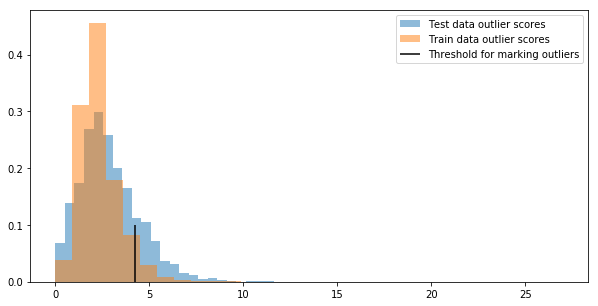

# Monitoring anomalies with KNN

In this article you will learn how to create a custom anomaly detection 
model based on the sample data. As a data source we will use census income
[dataset](https://archive.ics.uci.edu/ml/datasets/census+income).
A target task for this dataset is to predict whether an income of a person
exceeds $50/yr. We already have a sample classifier implementation
[here](https://github.com/Hydrospheredata/hydro-serving-example/tree/master/examples/adult).

So, let's start with the monitoring model itself. 

## Model Training

As a monitoring model we will use KNN outlier detection algorithm from 
[pyod](https://github.com/yzhao062/pyod) package. Each incoming sample 
will be scored against predefined clusters and the final value will be 
exposed as a monitoring value. 

We will skip most of the data preparation steps just for the sake of 
simplicity. 

```python
df = pd.read_csv("../data/adult.data", header=None)
target_labels = pd.Series(df.iloc[:, -1], index=df.index)

df = df.iloc[:, features_to_use]
df.dropna(inplace=True)

# Run feature engineering and then transformations on all features.
for feature, func in transformations.items():
    df[feature] = func(df[feature])

X_train, X_test = train_test_split(np.array(df, dtype="float"), test_size=0.2)

monitoring_model = KNN(contamination=0.05, n_neighbors=15, p = 5)
monitoring_model.fit(X_train)
```

## Model Evaluation

To check that our model works properly, lets plot histograms for training 
and testing datasets. 

```python
y_train_pred = monitoring_model.labels_  # binary labels (0: inliers, 1: outliers)
y_train_scores = monitoring_model.decision_scores_  # raw outlier scores

# Get the prediction on the test data
y_test_pred = monitoring_model.predict(X_test)  # outlier labels (0 or 1)
y_test_scores = monitoring_model.decision_function(X_test)  # outlier scores

plt.hist(
    y_test_scores,
    bins=30, 
    alpha=0.5, 
    density=True, 
    label="Test data outlier scores"
)
plt.hist(
    y_train_scores, 
    bins=30, 
    alpha=0.5, 
    density=True, 
    label="Train data outlier scores"
)

plt.vlines(monitoring_model.threshold_, 0, 0.1, label = "Threshold for marking outliers")
plt.gcf().set_size_inches(10, 5)
plt.legend()
```



## Deployment

To create a monitoring metric we have to deploy that KNN model as a 
separate model on Hydrosphere. Let's save a trained model for serving. 

```python
import joblib
joblib.dump(monitoring_model, "../monitoring_model/monitoring_model.joblib")
```

Create a new directory, where we will declare the serving function and its
definitions. 

```sh
mkdir -p monitoring_model/src
cd monitoring_model
touch src/func_main.py
```

Inside `src/func_main.py` put the following code:

```python
import hydro_serving_grpc as hs
import numpy as np
from joblib import load

monitoring_model = load('/model/files/monitoring_model.joblib')

features = ['age',
            'workclass',
            'education',
            'marital_status',
            'occupation',
            'relationship',
            'race',
            'sex',
            'capital_gain',
            'capital_loss',
            'hours_per_week',
            'country']


def extract_value(proto):
    return np.array(proto.int64_val, dtype='int64')[0]


def predict(**kwargs):
    extracted = np.array([extract_value(kwargs[feature]) for feature in features])
    transformed = np.dstack(extracted).reshape(1, len(features))
    predicted = monitoring_model.decision_function(transformed)

    response = hs.TensorProto(
        double_val=[predicted.item()],
        dtype=hs.DT_DOUBLE,
        tensor_shape=hs.TensorShapeProto())

    return hs.PredictResponse(outputs={"value": response})

```

This model also have to be packed with a model definition.

```yaml
kind: Model
name: "census_monitoring"
payload:
  - "src/"
  - "requirements.txt"
  - "monitoring_model.joblib"
runtime: "hydrosphere/serving-runtime-python-3.6:0.1.2-rc0"
install-command: "pip install -r requirements.txt"
contract:
  name: "predict"
  inputs:
    age:
      shape: scalar
      type: int64
      profile: numerical
    workclass:
      shape: scalar
      type: int64
      profile: numerical
    education:
      shape: scalar
      type: int64
      profile: numerical
    marital_status:
      shape: scalar
      type: int64
      profile: numerical
    occupation:
      shape: scalar
      type: int64
      profile: numerical
    relationship:
      shape: scalar
      type: int64
      profile: numerical
    race:
      shape: scalar
      type: int64
      profile: numerical
    sex:
      shape: scalar
      type: int64
      profile: numerical
    capital_gain:
      shape: scalar
      type: int64
      profile: numerical
    capital_loss:
      shape: scalar
      type: int64
      profile: numerical
    hours_per_week:
      shape: scalar
      type: int64
      profile: numerical
    country:
      shape: scalar
      type: int64
      profile: numerical
    classes:
      shape: scalar
      type: int64
      profile: numerical
  outputs:
    value:
      shape: scalar
      type: double
      profile: numerical
```

Inputs of this model are the inputs of the monitored model plus the outputs 
of the monitored model. As an output for the monitoring model we use `value` 
field. 

Pay attention to the model's payload. It has `src` folder that we've just 
created, `requirements.txt` with all dependencies and `monitoring_model.joblib`, 
e.g. our newly trained serialized KNN model. 

`requirements.txt` looks like this: 

```
joblib==0.13.2
numpy==1.16.2
pyod==0.7.4
```

The final directory structure should look like this: 

```
.
├── monitoring_model.joblib
├── requirements.txt
├── serving.yaml
└── src
    └── func_main.py
```

From that folder upload the model to the cluster.

```sh
hs upload
```

Create a new monitoring application from the model you've just uploaded.

```sh
hs apply -f - <<EOF
kind: Application
name: census_monitoring
singular:
  model: census_monitoring:1
EOF
```

@@@ note
`census_monitoring:1` stands for __first__ model version of 
__census_monitoring__ model. 
@@@

## Monitoring

We already have an `adult-scalar` application running on our cluster. 
Let's configure the monitoring metric for it, that we've just created 
 
Open _Monitoring_ tab from the `adult-scalar` model and click configuration 
gear icon on the right-hand side. From there click `Add Metric` button, 
specify the name and select kind of metric as Custom Model metric. Set 
threshold to be equal to `monitoring_model.threshold_`. In our case it's 
`4.238332161694875`. As a comparison operator choose `Greater`. This means
that if you have a metric value that is greater than a specified threshold, 
an alarm would be fired. 

That's it, now you have a monitored adult classifier model deployed in
production. 