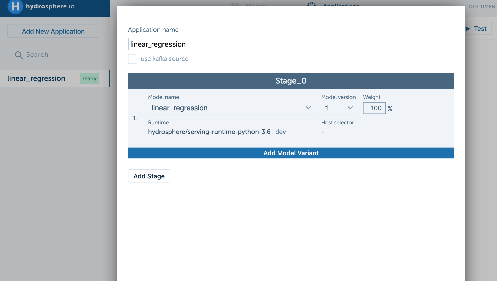

# Quickstart 

In this page you'll learn how to deploy your first model on Hydrosphere 
platform. We will start from scratch and create a simple linear regression 
model that will learn to fit our randomly generated data with some noise 
added to it. After the training step we will pack it, deploy to the platform 
and invoke it locally with a sample client. 

@@@ note
You can find other examples on how to deploy various models in our 
[repository](https://github.com/Hydrospheredata/hydro-serving-example).
@@@

## Prerequisites

We assume you already have a [deployed](/installation.md) instance of 
Hydrosphere platform and a @ref[CLI](../install/index.md#CLI) on your local 
machine.

### Setup a cluster

First of all, we need to let CLI know where is our serving cluster.

```sh 
hs cluster add --name local --server http://localhost
hs cluster use local
```

## Training a model 

Now we can start working with the linear regression model. It's a fairly 
simple model that fits randomly generated regression data with some noise 
added to it. For data generation we will use `sklearn.datasets.make_regression`
([Link](https://scikit-learn.org/stable/modules/generated/sklearn.datasets.make_regression.html))
method. We will also normalize data to the [0, 1] range. The model will be built 
using [Keras](https://keras.io/) library with [Tensorflow](https://www.tensorflow.org/) 
backend. 

First of all, create a directory for the model and add `model.py` inside it.

```sh
 mkdir linear_regression
 cd linear_regression
 touch model.py
```

The model will consist of 3 fully-connected layers with first two of them having 
ReLU activation function and 4 units, and the last one will be a summing unit 
with the linear activation. Put the following code in your `model.py` file. 

```python
from keras.models import Sequential
from keras.layers import Dense
from sklearn.datasets import make_regression
from sklearn.model_selection import train_test_split
from sklearn.preprocessing import MinMaxScaler

# initialize data
n_samples = 1000
X, y = make_regression(n_samples=n_samples, n_features=2, noise=0.5, random_state=112)

scallar_x, scallar_y = MinMaxScaler(), MinMaxScaler()
scallar_x.fit(X)
scallar_y.fit(y.reshape(n_samples, 1))
X = scallar_x.transform(X)
y = scallar_y.transform(y.reshape(n_samples, 1))

# create a model
model = Sequential()
model.add(Dense(4, input_dim=2, activation='relu'))
model.add(Dense(4, activation='relu'))
model.add(Dense(1, activation='linear'))

model.compile(loss='mse', optimizer='adam')
model.fit(X, y, epochs=100)

# save model
model.save('model.h5')
```

We have not installed necessary libraries for our model yet. In your 
linear_regression folder create `requirements.txt` file with following 
requirements:

```
Keras==2.2.5
tensorflow==1.14.0
numpy==1.17.2
scikit-learn==0.20.2
```

Install all dependencies to your local environment.

```sh
pip install -r requirements.txt
```

Train the model.

```sh
python model.py
```

As soon as script finishes, you will get a model saved in `model.h5` 
file.

## Model preparation

Every model in a cluster is deployed as an individual container. After 
request is sent from the client application, it is passed to the appropriate 
Docker container with your model deployed on it. An important detail is 
that all model's files are stored in the `/model/files` directory inside 
the container. So, we will look up in there in order to load the model. 

To run this model we will use a Python runtime that will basically 
execute any Python code which you will provide. Preparation of a model is 
pretty straightforward, though you have to follow some rules:

1. Stick to the specific folder structure in order to let `hs` parse and 
upload it correctly;
2. Provide necessary dependencies with `requirements.txt`;
3. Provide contract file to let model manager understand model's inputs 
and outputs. 

We will start with the main functional file. 

```sh 
 mkdir src
 cd src
 touch func_main.py
```

Serving communicates with the model using [TensorProto](https://github.com/Hydrospheredata/hydro-serving-protos/blob/master/src/hydro_serving_grpc/tf/tensor.proto) 
messages. If you want to perform some transformation on the received TensorProto 
message you have to retrieve its contents, perform a transformation on them and 
pack the result back to the TensorProto message. To do that you have to define a 
function, that will be invoked every time Hydrosphere handles a request and passes 
it to the model. Inside the function you have to call a `predict` (or similar) 
method of your model and return your predictions. 

```python
import numpy as np
import tensorflow as tf
import hydro_serving_grpc as hs
from keras.models import load_model

# 0. Load model once
model = load_model('/model/files/model.h5')
graph = tf.get_default_graph() 

def infer(x):
    # 1. Retrieve tensor's content and put it to numpy array
    data = np.array(x.double_val)
    data = data.reshape([dim.size for dim in x.tensor_shape.dim])

    # 2. Make a prediction
    with graph.as_default():
        result = model.predict(data)
    
    # 3. Pack the answer
    y_shape = hs.TensorShapeProto(dim=[hs.TensorShapeProto.Dim(size=-1)])
    y_tensor = hs.TensorProto(
        dtype=hs.DT_DOUBLE,
        double_val=result.flatten(),
        tensor_shape=y_shape)

    # 4. Return the result
    return hs.PredictResponse(outputs={"y": y_tensor})
```

Since we need to initialize our model we will have to do that outside of our 
serving function, if we don't want to initialize the model every time the 
request comes in. We do that on step (0). The serving function `infer` takes 
the actual request, unpacks it (1), makes a prediction (2), packs the answer 
back (3) and returns it (4). There's no a strict rule on how to name your 
serving function, it just have to be a valid python function name (since we 
use a Python runtime). 

If you're wondering how Hydrosphere will understand, which function to call from 
`func_main.py` file, then the answer is — we have to provide a __contract__. A 
contract is a file, that defines the inputs and outputs of the model, signature 
functions and some other metadata required for serving. Go to the root directory 
of the model and create a `serving.yaml` file. 

```sh
cd ..
touch serving.yaml
```

@@@ vars
```yaml
kind: Model
name: linear_regression
runtime: "hydrosphere/serving-runtime-python-3.6:$project.released_version$"
install-command: "pip install -r requirements.txt"
payload:
  - "src/"
  - "requirements.txt"
  - "model.h5"

contract:
  name: infer
  inputs:
    x:
      shape: [-1, 2]
      type: double
      profile: numerical
  outputs:
    y:
      shape: [-1]
      type: double
      profile: numerical
```
@@@

Here you can see, that we've provided a `requirements.txt` and a `model.h5` as 
payload files to our model. 

Overall structure of our model now should look like this:

```sh
linear_regression
├── model.h5
├── model.py
├── requirements.txt
├── serving.yaml
└── src
    └── func_main.py
```
@@@ note
Although, we have `model.py` inside directory, it won't be uploaded to cluster 
since we didn't specify it in the contract's payload.
@@@

## Serving the model

Now we can upload the model. Inside the `linear_regression` directory execute the 
following command: 

```sh
 hs -v upload
```

`-v` flag stands for verbose output. 

You can open [http://localhost/models](http://localhost/models) page to see the 
uploaded model. 

Once you've done that, you can create an __application__ for it. Basically, an 
application represents an endpoint to your model, so you can invoke it from 
anywhere. To learn more about advanced features, go to the 
[Applications](concepts/applications.md) page. 



Open [http://localhost/applications](http://localhost/applications), press 
`Add New Application` button. In the opened window select `linear_regression` 
model, name your application `linear_regression` and click creation button. 

If you cannot find your newly uploaded model and it's listed in your models 
page, this probably means that it's still in a building stage. Wait until 
the model changes its status to `Released`, then you can use it.

## Invoking an application

Invoking applications is available via different interfaces. 

### Test request

You can perform test request to the model from UI interface. Open a desired 
application and press `Test` button. Internally it will generate arbitrary 
input data from model's contract and send an HTTP-request to the application's 
endpoint. 

### HTTP request

Send an HTTP `POST` request. 

```sh 
curl --request POST --header 'Content-Type: application/json' --header 'Accept: application/json' \
    --data '{"x": [[1, 1],[1, 1]]}' 'http://localhost/gateway/application/linear_regression'
```

For more information about invoking applications refer to this 
[page](../how-to/invoke-applications.html).

### gRPC API call

Define a gRPC client on your side and make a call from it.

```python
import grpc 
import hydro_serving_grpc as hs  # pip install hydro-serving-grpc

# connect to your ML Lamba instance
channel = grpc.insecure_channel("localhost")
stub = hs.PredictionServiceStub(channel)

# 1. define a model, that you'll use
model_spec = hs.ModelSpec(name="linear_regression", signature_name="infer")
# 2. define tensor_shape for Tensor instance
tensor_shape = hs.TensorShapeProto(
    dim=[
        hs.TensorShapeProto.Dim(size=-1), 
        hs.TensorShapeProto.Dim(size=2)
    ]
)
# 3. define tensor with needed data
tensor = hs.TensorProto(dtype=hs.DT_DOUBLE, tensor_shape=tensor_shape, double_val=[1,1,1,1])
# 4. create PredictRequest instance
request = hs.PredictRequest(model_spec=model_spec, inputs={"x": tensor})

# call Predict method
result = stub.Predict(request)
```
