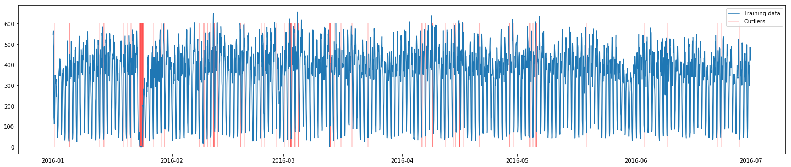

# Monitoring anomalies with a stateful model

In this article you will learn how to create a custom anomaly detection 
model based on the sample data. As a data source we will use
[data](https://www1.nyc.gov/site/tlc/about/tlc-trip-record-data.page) 
from NYC Taxi & Limousine Commission. As a target task we chose to predict 
a number of taxi pickups in the next hour based on observations from the
last 5 hours.

## Prerequisites 

We will skip implementation details about the model itself. However, we must
know what are the inputs and the outputs of the model. In our case model 
definition looks like this:

@@@ vars
```yaml
kind: Model
name: nyc_taxi
runtime: "hydrosphere/serving-runtime-python-3.6:$project.released_version$"
install-command: "pip install -r requirements.txt"
payload:
  - "src/"
  - "requirements.txt"
  - "model.joblib"

contract:
  name: infer
  inputs:
    pickups_last_hour:
      shape: scalar
      type: int32
      profile: numerical
  outputs:
    pickups_next_hour:
      shape: scalar
      type: int32
      profile: numerical
```
@@@

So let's create a monitoring metric for that model. 

## Model Training

As a monitoring model we will use an autoregressive stateful IsolationForest 
model, which will be continuously retrained on a window of 5 consequent 
data samples. 

We will skip most of the data preparation steps just for the sake of 
simplicity. 

```python
df = pd.read_csv("../data/taxi_pickups.csv")
df.set_index(pd.to_datetime(df.pickup_datetime),inplace=True)
df.drop(["pickup_datetime"], axis=1, inplace=True)

data, _ = transform_to_sliding_windows(df)
iforest = IsolationForest(
    n_jobs=-1, random_state=42,  behaviour="new", contamination=0.03)
is_outlier = iforest.fit_predict(data)
# Find outliers in training data 
outlier_indices = df.index[6:][is_outlier==-1]
```

## Model Evaluation

To check that our model works properly, lets plot training data and outliers.

```python
plt.plot(df.index, df.pickups, label="Training data")
plt.vlines(outlier_indices, 0, 600, colors="red", alpha=0.2, label="Outliers")

plt.gcf().set_size_inches(25, 5)
plt.legend()
```



From the plot you can see massive amount of anomalies in the end of January 
2016. These outliers came from travel ban due to 
["Snowzilla"](https://en.wikipedia.org/wiki/January_2016_United_States_blizzard).

## Deployment

To create a monitoring metric we have to deploy that IsolationForest model as a 
separate model on Hydrosphere. Let's save a trained model for serving. 

```python
import joblib
joblib.dump(iforest, '../monitoring_model/iforest.joblib')
```

Create a new directory, where we will declare the serving function and its
definitions. 

```sh
mkdir -p monitoring_model/src
cd monitoring_model
touch src/func_main.py
```

Inside `src/func_main.py` put the following code:

```python
import numpy as np
import hydro_serving_grpc as hs
from joblib import dump, load
import collections

global window
# Default value, means sample is 'inlier'
init_value = 1.0
# Length of data sequence required for model.
window_len = 5

window = collections.deque(maxlen=window_len)
outlier_detection_model = load('/model/files/iforest.joblib')


def infer(pickups_last_hour, pickups_next_hour):
    global window

    # Contract (serving.yaml) defines that type of input is int,
    # so take int_val from input sample.
    input_value = int(pickups_last_hour.int_val[0])
    # The pickups_next_hour parameter is a prediction of monitoring_model.
    # It is optional for use depending on particular outlier detection technique.
    # (not used in this method)

    if len(window) < window_len-1:
        window.append(input_value)
        return pack_predict(init_value)
    else:
        window.append(input_value)
        prediction_vector = np.array(window)
        # 2. Make a prediction
        result = outlier_detection_model.predict(prediction_vector.reshape(1, 5))
        # 3. Pack the answer
        return pack_predict(result[0])

def pack_predict(result):
    ret = [result]
    y_tensor = hs.TensorProto(
        dtype=hs.DT_DOUBLE,
        double_val=ret,
        tensor_shape=hs.TensorShapeProto())
    # 4. Return the result
    return hs.PredictResponse(outputs={"value": y_tensor})
```

This model also have to be packed with a model definition.

@@@ vars
```yaml
kind: Model
name: nyc_taxi_monitoring
runtime: "hydrosphere/serving-runtime-python-3.6:$project.released_version$"
install-command: "pip install -r requirements.txt"
payload:
  - "src/"
  - "requirements.txt"
  - "iforest.joblib"

contract:
  name: infer
  inputs:
    pickups_last_hour:
      shape: scalar
      type: int32
      profile: numerical
    pickups_next_hour:
      shape: scalar
      type: int32
      profile: numerical
  outputs:
    value:
      shape: scalar
      type: double
      profile: numerical
```
@@@

Inputs of this model are the inputs of the monitored model plus the outputs 
of the monitored model. As an output for the monitoring model we use `value` 
field. 

Pay attention to the model's payload. It has `src` folder that we've just 
created, `requirements.txt` with all dependencies and `iforest.joblib`, 
e.g. our newly trained serialized IsolationForest model. 

`requirements.txt` looks like this: 

```
joblib==0.13.2
numpy==1.16.2
scikit-learn==0.20.2
```

The final directory structure should look like this: 

```
.
├── iforest.joblib
├── requirements.txt
├── serving.yaml
└── src
    └── func_main.py
```

From that folder upload the model to the cluster.

```sh
hs upload
```

Create a new monitoring application from the model you've just uploaded.

```sh
hs apply -f - <<EOF
kind: Application
name: nyc_taxi_monitoring
singular:
  model: nyc_taxi_monitoring:1
EOF
```

@@@ note
`nyc_taxi_monitoring:1` stands for __first__ model version of 
__nyc_taxi_monitoring__ model. 
@@@

## Monitoring

We already have an `nyc_taxi` application running on our cluster. 
To configure monitoring metric for it, we have to open _Monitoring_ 
tab from the `nyc_taxi` model and click configuration gear icon on the 
right-hand side. From the we click `Add Metric` button, specify the 
name and select Custom Model metric kind. Set the threshold to be 0. 
As a comparison operator we choose `GreaterEq`. This means that 
whenever our metric value drops below 0, an alarm would be fired. 

That's it, now we've created a custom monitoring model which can 
be used in production as one of possible outlier detectors. 
