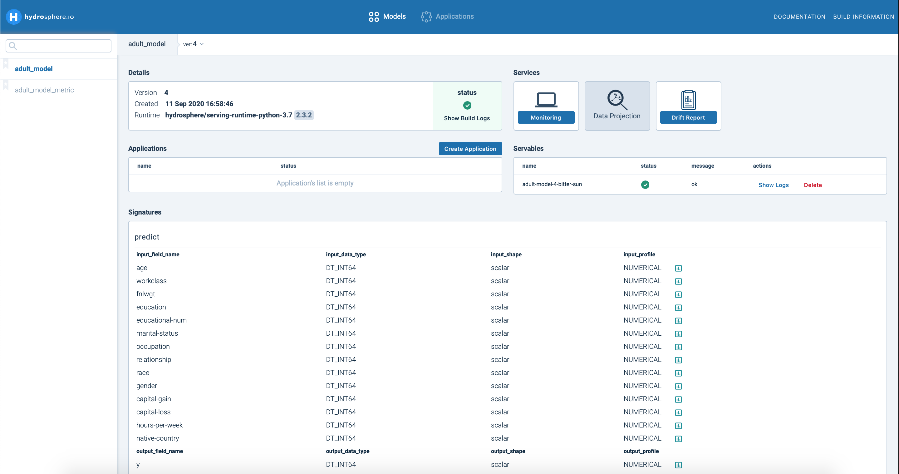

# Train & Deploy Census

This tutorial shows how to train and deploy a model for a classification task based on the [Adult Dataset](https://www.kaggle.com/wenruliu/adult-income-dataset). The main steps of this process are data prep, training a model, uploading a model to the cluster and making a prediction on test samples.

## Before you start

We assume that you already have a deployed instance of the Hydrosphere cloud platform and Hydro CLI installed on your local machine. If you haven't done this yet, please explore these pages first: 





For this tutorial, you should be using a local cluster. To ensure that, run `hs cluster` in your terminal. This command will show name and server address of a cluster you’re currently using. If it shows that you're not using a local cluster, you can configure it with the following commands: 

```text
$ hs cluster add --name local --server http://localhost
$ hs cluster use local
```

## Data preparation

Model training always requires some amount of  initial preparation, most part of which is a data preparation. The Adult Dataset consists of 14 descriptors, 5 of which are numerical and 9 categorical, including class column. 

Categorical features are usually presented as a string. This is not  an appropriate data type for sending it into a model, so we need to transform it first. We can remove rows that contain question marks in some samples. Once the preprocessing is complete, you can delete the DataFrame \(`df`\). 

```python
import pandas as pd
import numpy as np
from sklearn.preprocessing import LabelEncoder  

df = pd.read_csv('adult.csv', sep = ',').replace({'?':np.nan}).dropna()

categorical_encoder = LabelEncoder()
categorical_features = ["workclass", "education", "marital-status", 
                        "occupation", "relationship", "race", 
                        "gender", "capital-gain", "capital-loss", 
                        "native-country", "income"]
                        
for column in categorical_features:
    df[column] = categorical_encoder.fit_transform(df[column])

X, y = df.drop('income', axis = 1), df['income']

del df
```

## Training a model

There are many classifiers that you can potentially use for this step. In this example, we’ll apply the Random Forest classifier. After preprocessing, the dataset will be separated into train and test subsets. The test set will be used to check whether our deployed model is able to process requests on the cluster. After the training step, we can save a model as a Python pickle serialization model with `joblib.dump()` in a model folder \(e.g. `/model`\).

```python
 from sklearn.ensemble import RandomForestClassifier
 from sklearn.model_selection import train_test_split
 import joblib 
 
 train_X, test_X, train_y, test_y = train_test_split(X, y.astype(int), 
                                                    stratify=y, test_size=0.2, 
                                                    random_state=random_seed)
 clf = RandomForestClassifier(n_estimators=20, 
                              max_depth=10, n_jobs=5, 
                              random_state=random_seed).fit(train_X, train_y)
                              
 joblib.dump(clf, '/model/model.joblib')
```

## Uploading a model to the cluster using SDK 

The easiest way to upload a model to your cluster is using the SDK. SDK allows Python developers to configure and manage model lifecycle on the Hydrosphere platform. Another way to configure a model through the `serving.yaml` file. Before uploading a model, you need to define your cluster: 

```python
from hydrosdk.contract import SignatureBuilder, ModelContract
from hydrosdk.cluster import Cluster

cluster = Cluster("http-cluster-address", 
                 grpc_address="grpc-cluster-address", ssl=True,
                 grpc_credentials=ssl_channel_credentials())
```

Next, we need to write a script, which will be uploaded to the Hydrosphere platform. This script will be performed each time you are sending a request to the model and getting a response to this request. Let's name our function file`func_main.py` and store it in an `src` folder inside the directory where your model is stored. The directory structure  should look like this:

```python
.
└── model
    └── model.joblib
    └── src
        └── func_main.py
```

The code in `func_main.py` should be as the following:

```python
import pandas as pd
from joblib import load


clf = load('/model/files/model.joblib')

cols = ['age', 'workclass', 'fnlwgt',
 'education', 'educational-num', 'marital-status',
 'occupation', 'relationship', 'race', 'gender',
 'capital-gain', 'capital-loss', 'hours-per-week',
 'native-country']

def predict(**kwargs):
    X = pd.DataFrame.from_dict({'input': kwargs}, 
                               orient='index', columns = cols)
    predicted = clf.predict(X)

    return {"y": predicted[0]}
```

As you might notice, we need to preserve column names as a list at the order they appear in the DataFrame. You can obtain this simply by `list(X.columns)` .  This we need to make sure that variables will be in a right order after transforming our dictionary for a prediction.

 In order to start working with the model on a cluster, we need to install necessary libraries during model's upload. Create a `requirements.txt` in the folder with your model and add following libraries to that:

```text
pandas==1.0.5
scikit-learn==0.23.2
joblib==0.16.0
```

Directory with all necessary dependencies should look like this:

```python
.
└── model
    └── model.joblib
    └── requirements.txt
    └── src
        └── func_main.py
```

Now we can proceed with uploading model to the cluster. Hydrosphere Serving has a strictly typed inference engine, so before uploading our model we need to specify it’s signature with`SignatureBuilder`. Signature contains information about which method inside your `func_main.py` should be called, as well as what its inputs and outputs shapes and types are. Given that we have several columns, we can apply method `.apply` several times. Don't forget to check what types of data you have for each column by `X.dtypes`. We can apply`int64` for all variables including income, which is our dependent variable and we can name it as 'y'  in a signature for a futher prediction. In addition, you can specify type of profiling for each variable so Hydrosphere could know what this variable is about and process it accordingly.  Finally, we can finish our signature by a `.build()` method. 

```python
from hydrosdk.contract import SignatureBuilder, ModelContract, ProfilingType

signature = SignatureBuilder('predict') 
for i in X.columns:
    signature.with_input(i, 'int64', 'scalar', ProfilingType.NUMERICAL)
signature = signature.with_output('y', 'int64', 
                                  'scalar', ProfilingType.NUMERICAL).build()
```

Next, we need specify which files will be uploaded to the cluster by making a `payload` that captures all necessary file paths together with `path` that defines a common folder. At this point we can combine all our efforts into the `LocalModel` object. LocalModels are models before they get uploaded to the cluster. LocalModels are containers for all the information required to instantiate a ModelVersion in a Hydrosphere cluster. We’ll call this model as`"adult_model"`. In addition, we need to specify environment in which our model will run. Such environments are called Runtimes. You can learn more about them [here](https://hydrosphere.io/serving-docs/latest/overview/concepts.html#runtimes). In this tutorial we will use default Python 3.7 runtime. This runtime uses `src/func_main.py` script as an entry point, that’s why we organised our files as we did. As a final parameter, you can define a path to the training data of you model, which is needed if you want to utilize additional services of Hydrosphere \(e.g. Automatic Outlier Detection\). 

```python
from hydrosdk.modelversion import LocalModel
from hydrosdk.image import DockerImage

path = "model/"
payload = ['src/func_main.py', 'requirements.txt', 'model.joblib']
contract = ModelContract(predict=signature)

local_model = LocalModel(name="adult_model", 
                         install_command = 'pip install -r requirements.txt',
                         contract=contract, payload=payload,
                         runtime=DockerImage("hydrosphere/serving-runtime-python-3.7", "2.3.2", None),
                         path=path, training_data = 'data/train.csv')
```

Everything is ready now for uploading our model to the cluster. The process consists of several steps:

1. After LocalModel is prepared we are simply applying `upload`method for uploading itself.
2. Then we can lock any interaction with the model until it will successfully uploaded.
3. `ModelVersion` helps to check whether our model was successfully uploaded to the platform by looking for it.

As a final step, we should deploy out model. To deploy a model you should create an Application - linear pipeline of ModelVersions with monitoring and other benefits. You can learn more about Applications [here](https://hydrosphere.io/serving-docs/latest/overview/concepts.html#applications). For the sake of simplicity, we’ll create just a Servable - a bare deployed instance of our model version without any benefits. Servables provide [Predictor](https://hydrospheredata.github.io/hydro-serving-sdk/hydrosdk/hydrosdk.predictor.html) objects, which should be used for data inference. You can also specify a format of an output that Predictor sends back as an inference.

```python
from hydrosdk.modelversion import ModelVersion
from hydrosdk.servable import Servable

uploaded_model = local_model.upload(cluster)
uploaded_model.lock_till_released()
uploaded_model.upload_training_data()
model_find = ModelVersion.find(cluster, name="adult_model", 
                               version=uploaded_model.version)
model_servable = Servable.create(cluster, model_name=uploaded_model.name, 
                                 version=uploaded_model.version)
predictor = model_servable.predictor(return_type=PredictorDT.DICT_NP_ARRAY)
```

Predictors provide `predict` method which we can use to send our data to the model. We can try to make predictions for our test set that has preliminarily been converted to a list of dictionaries. You can check results using the name you have used for an output of Signature and preserve it in any format you would prefer. Before making prediction don't forget to make a small pause to finish model's upload.

```python
import time
time.sleep(15)
results = []
time_start = time.perf_counter()
for x in test_X.to_dict('records'):
    result = predictor.predict(x)
    results.append(result['y'])
```

## Final outlook 

If you want to interact with your model by Hydrosphere UI, you can use `http://localhost`. Here you can find all your models, its different versions, building logs, created applications, related information about model's environment and other services associated with deployed models by clicking on model and its version. You might notive that there has appreaed an additional model with `metric` name in it. This is your automatically formed monitoring model for outlier detection. You can read an additional information about it [here](https://app.gitbook.com/@hydrosphere/s/home/~/drafts/-MGXnQ-s_FHYMKmmyWjM/overview/features/automatic-outlier-detection). 



In order to configure additional external metrics as well as check values for already existing one, you can go to Monitoring profile. That's it! Don't forget to check our other sections to be more familiar with Hydrosphere and its services.

## Additional section: Deploying model with serving.yaml

